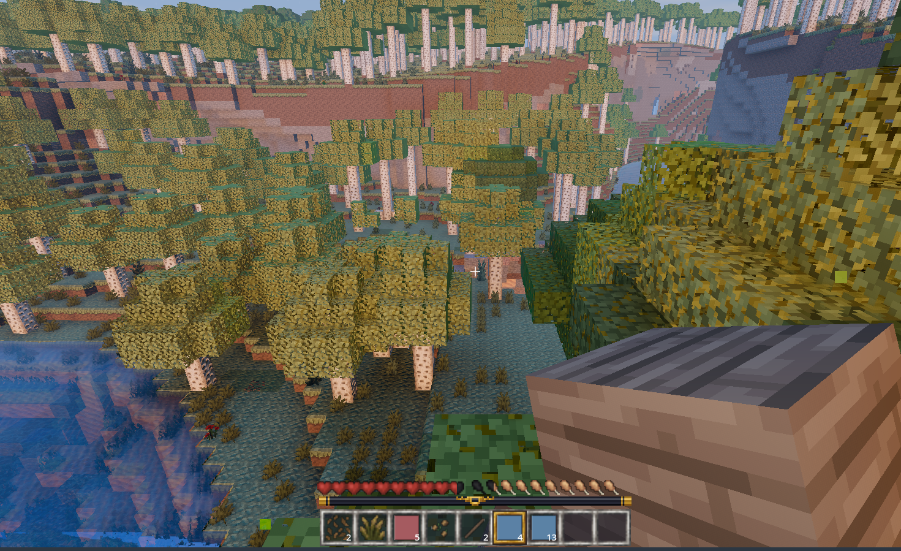
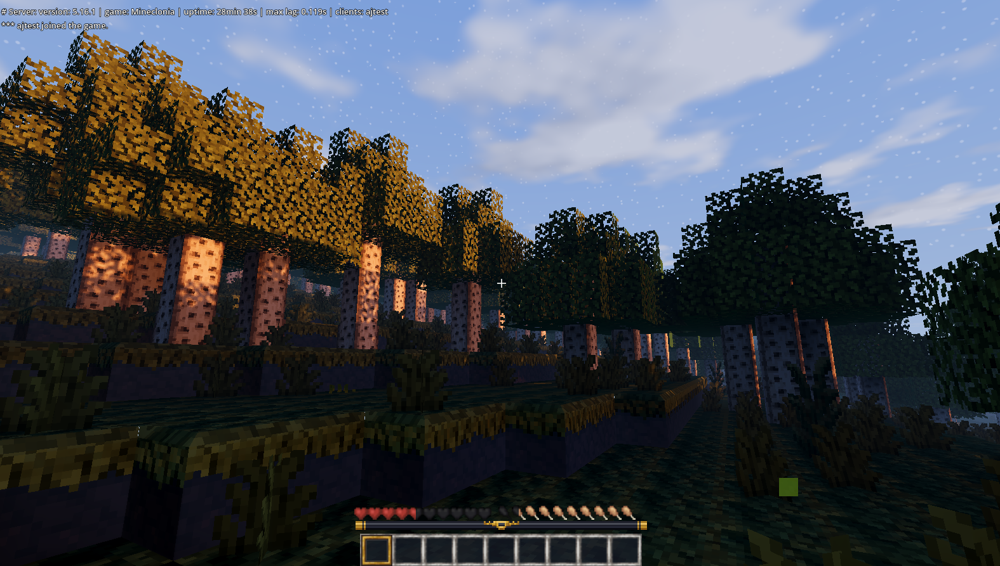
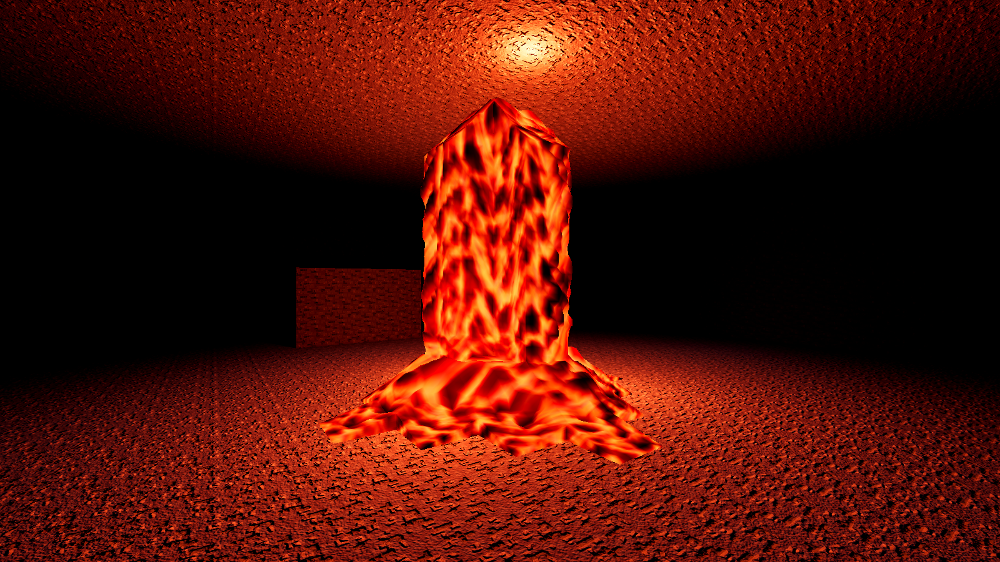
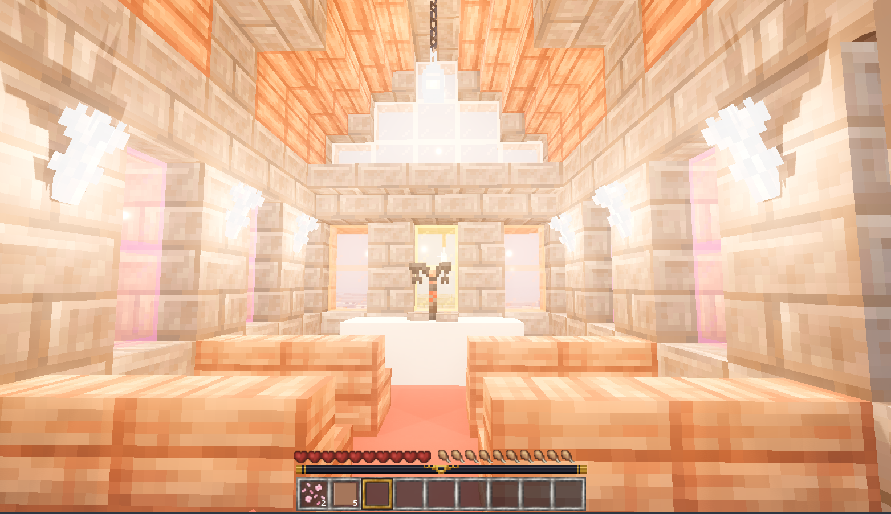
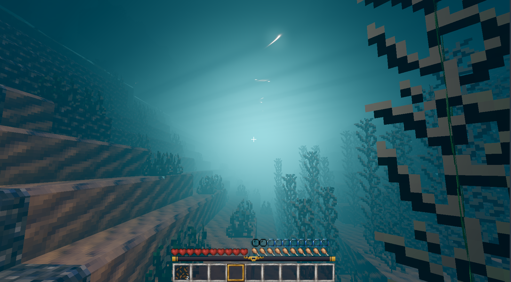
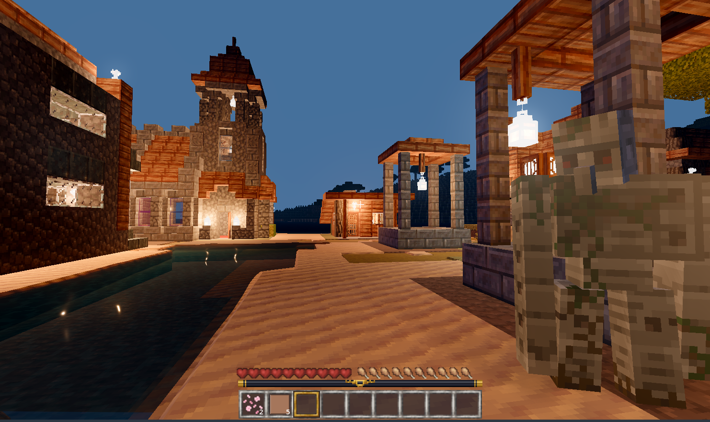

# Goanna

**A different way to look at Luanti worlds.** Same servers, same games, same
worlds, drawn with a modern game renderer.



## What is this?

[Luanti](https://www.luanti.org/) is a free and open source voxel game
engine, the one that used to be called Minetest. People build games on it,
run public servers, and play them with Luanti's own client.

Goanna is a second client for those same servers. You log in with the same
name, to the same worlds, playing the same games. Luanti calls the cubes a
world is made of *nodes*, and so does the rest of this page. Nothing about the server
changes, and nothing about the game changes. The only difference is what
happens on your screen.

The reason it exists is that a Luanti world already contains more than its
renderer can show. Sunlight through a canopy, light bouncing off a coloured
wall, soft shadow in a doorway: the shapes and the textures are all there
already, and a modern renderer can find things in them that nobody had to
build. Goanna hands the world to [Godot 4](https://godotengine.org/) and
lets it do that.

Here is the same patch of forest with the lighting off and on. Same nodes,
same textures, no new art:

| Lighting off | Lighting on |
| --- | --- |
|  |  |

That pair is from an early test, rendered offline rather than by the client,
so treat it as the target rather than the current state. The picture at the
top of this page is the real thing.

## Can I play it yet?

Nearly, some things are still a bit janky.

Pick a game from the menu and Goanna starts a server for you, so you no
longer have to find one first. Then you can walk around, dig and place,
chat, watch your health and hunger bars, open your inventory and the game's
own menus, and move items between slots. You can fight a mob and pick up
what it drops. Players and mobs have their real models and animations, and
chests and furnaces open when you click them.

What is missing is the long tail: some dropped items on the ground are
placeholder boxes, animated node textures do not advance yet, particle
coverage is not complete, and a hundred small things a game notices before
you do. Crafting through the inventory grid does not work for all things.

So: worth a look, not yet worth moving into. The Luanti client remains the
one that works, and will always be the reference implementation.

**If you want to follow along**, the pictures in [docs/](docs/) get updated
as things land, and `PLAN.md` says where it is heading.

**If you want to try it**, see below. You will need to build it yourself,
on Linux, for now.

**If you want to help**, [CONTRIBUTING.md](CONTRIBUTING.md) says what would
actually be useful right now. Short version: build it on a machine that is
not the author's and tell us what broke.

## Trying it

You need Godot 4.5, a discrete graphics card with a working Vulkan driver, a
C++ toolchain, and Luanti installed. Goanna asks more of a machine than the
vanilla client does, on purpose: see
[docs/requirements.md](docs/requirements.md), which has measured numbers and
answers the Raspberry Pi question.

```sh
git clone --recurse-submodules --shallow-submodules \
    https://github.com/p0ss/Goanna.git goanna
cd goanna
cmake -S . -B build -G Ninja -DCMAKE_BUILD_TYPE=RelWithDebInfo
cmake --build build
```

Then run it:

```sh
/path/to/Godot_v4.5.1-stable_linux.x86_64 --path project
```

The menu offers "Start a local game" or "Join a server". A local game is not
a singleplayer mode: Goanna finds the Luanti you already have installed,
starts an ordinary server with it on localhost, joins over the ordinary
protocol, and shuts it down when you leave. Joining a server wants an
address, a name and a password.

W A S D to walk, mouse to look, space to jump, left and right mouse to dig
and place, number keys to change item, I for the inventory, T to chat, F for
a free camera, escape for the pause menu.

There is one extra step the first time, and a couple of known rough edges.
Full instructions, dependencies for common distributions and a
troubleshooting list are in **[docs/building.md](docs/building.md)**.

## What works, and what does not

As at August 2026, it is an alpha.

**Works.** Connecting and logging in to ordinary servers. The world itself:
terrain, plants, water, glass and every other node shape, built by Luanti's
own rules so nodes look the way the game intended. Walking, jumping,
sneaking and falling, at the server's speeds. Digging and placing, with the
right tool timings. The sky, the sun and moon, day and night. Torches and
other glowing nodes that actually light the room. Nodes appearing and
disappearing as other players change the world.

And an interface: crosshair and hotbar, the health, breath, hunger and
experience bars the server sends, chat in both directions, your inventory
and the game's own menus drawn from its formspecs, moving and splitting
stacks between slots, a pause menu and a death screen. Players, mobs and
model nodes arrive with their real models and animations, loaded by Luanti's
own B3D, X, OBJ and glTF readers. Digging, placing, fighting a mob and
collecting its drops, and falling to your death all work, at the server's own
timings. In first person, your held item, its swing and your own body are
drawn too, with an option to hide the body.

Server-driven and local sounds play, including positional sounds, footsteps,
digging and placing. One-shot particles and server particle spawners are also
drawn, which brings weather such as rain and snow into the world. Particle
support is new and has not yet been tested against the full range of effects
games can define.

Goanna will also use authored material maps if a server ships them. Beside
an ordinary node texture it looks for LabPBR companions, the same files a
shader pack for Minecraft carries, and reads real normals, roughness,
metalness and emission from them. No protocol change and no server patch is
needed: any server can serve a pack today, and textures without one get a
material from what the node is (its footstep sound, groups and drawtype,
the same table for every game) and relief inferred from their own
brightness, so authored maps override rather than being the only source. Verified against a CC0 pack
served from a worldmod, though the sample mapping covers only eight
Mineclonia textures so far, because such packs name blocks the Minecraft
way and each Luanti game names them its own way. `tools/pbr_pack.py` builds
a pack from that kind of source, and [docs/materials.md](docs/materials.md)
describes the convention and what it leaves unsettled.

The screen space half of an Iris or OptiFine shader pack loads too: the
`composite` and `final` programs are translated to Vulkan GLSL and run as a
Godot compositor effect, reading the scene colour and depth. This is new,
tested only with the proof pack in `project/tests/shaderpacks/`, and no real
pack has been run yet. The `gbuffers` and `shadow` programs, which draw the
world, are not loaded, so a pack's lighting model does not apply; see
[docs/iris-compat.md](docs/iris-compat.md) for what that means and the plan.

Distant terrain is drawn in coarser tiers the further it is, merged into a
handful of meshes, on the same shader and textures as the ground at your
feet, with its light and a baked occlusion term carried along. Every block
the server sends is also kept in a local store, per server, and where a
server grants it (its operator sets `goanna_far_rendering` with the server
mod in `goanna_server_mod/`; Goanna's own single player server does) the far
tiers draw from that store beyond the server's send distance, marked as
remembered rather than seen. Observed against a local Mineclonia server on
Godot 4.5.1: terrain 400 nodes behind the live range drawn from a previous
visit. Without the grant the store only writes. The plan and the limits are
in [docs/far-rendering.md](docs/far-rendering.md).

Then the parts that are Goanna's own rather than Luanti's: a water shader
with vertex waves and refraction, waving leaves and plants, distance fog and
an underwater tint, chamfered edges on solid nodes, surface relief derived
from each texture's own brightness, and motes drifting over leaves, flowers
and sand. Those four are sliders in a video settings panel, on by default,
and each takes effect immediately. The sun follows Luanti's own path, so
low light at either end of the day is genuinely warm and directional rather
than a filter.

**Does not work.** Some dropped items lying on the ground are still
placeholder boxes. Animated node textures remain on their first frame. Some
particle behaviours and the batched particle packet are not implemented.
Windows and macOS have not been play-tested.

Node lighting has landed, so caves are dark and a torch matters underground,
and the daylight balance was reset on a material chart rather than by eye:
sunlit surfaces no longer clip to white, walls are no longer black at noon
and night is a dim blue rather than black. Whether the overall level suits
you is a slider (Exposure and Sky fill in the Lighting tab); the numbers it
was set by are in [docs/pbr-plan.md](docs/pbr-plan.md).

| Forest and held item | Lava underground | Coloured node light |
| --- | --- | --- |
|  |  |  |

| Underwater | Village at night |
| --- | --- |
|  |  |

The [early lighting comparison sheet](docs/e0a_contact_sheet.png) and the
rest of the project notes are in [docs/](docs/).

A packet by packet breakdown, for the curious, is in
[docs/protocol-coverage.md](docs/protocol-coverage.md).

## Is it official? Is it cheating?

Neither.

> Goanna is an independent project. It is not affiliated with, endorsed by
> or supported by the Luanti project. The name "Luanti" is used here only to
> identify the software Goanna interoperates with.

On cheating, the boundaries are permanent rather than a current limitation.
Goanna asks a server for nothing that Luanti's own client does not ask for,
and shows you nothing the server did not send. No seeing through walls, no
extra reach, no automation, no peering through darkness the game meant you
not to see. It does not modify servers and does not ship a game of its own.
Anything that would give a Goanna player an advantage over anyone else is out
of scope **without that server's consent**.

That last clause is the whole of it. Goanna never decides for itself that a
player may do more than a vanilla client can. A server may decide otherwise
for its own players, and there is an optional mod for saying so, but a server
that has never heard of Goanna gets a client that behaves exactly like any
other. Absence of permission is the default, not an oversight.

That matters because "alt client" has usually meant "cheat client" around
here, and this one is not going to blur the line.

---

# For developers

## How it works

Luanti's client is less tangled up in its renderer than it looks. Outside
`src/client` and `src/gui`, the engine barely touches Irrlicht at all, which
makes a transplant plausible where a rewrite would not be.

So Goanna carries Luanti's client logic across, the networking, world
handling, movement prediction and node meshing rules, and replaces only what
Irrlicht used to provide: rendering, widgets, model loading, input and the
window. Parity with vanilla movement is not something Goanna has to chase,
because it is running the same code.

That happens in three tiers:

1. **Compiled from the submodule, untouched.** The network layer,
   serialisation, node and item definitions, MapBlock and Map, inventory,
   the SRP stack. About fifty files, listed in `cmake/luanti_core.cmake`.
2. **Copied into `src/transplant/`, changed as little as the compiler
   allows.** Only files that cannot build as they are. Each keeps its
   upstream copyright header, gains a note saying what changed, and appears
   in an inventory table.
3. **Goanna's own code.** The Godot side, plus the session thread.

Tier 2 is kept deliberately small, because tier 2 is what has to be
re-applied at every Luanti release. The rules, the inventory and the
upstream tracking procedure are in
**[docs/transplanting.md](docs/transplanting.md)**.

Goanna does not fork Luanti and there is no patch queue against the engine.
`luanti/` is a submodule pinned to a release tag, currently 5.16.1.

## Where it is going

`PLAN.md` has the full plan. The short version is a compatibility ladder:

1. A plain game and devtest: nodes, movement, basic interaction.
   **Substantially working.**
2. minetest_game, the classic baseline. **Substantially working.**
3. Mineclonia and VoxeLibre: models, the full formspec corner case zoo,
   particles, attachments. **In progress.** This is the bar for being usable
   by the community, and the games people actually play.
4. Server sent client side modding, mirroring upstream when it lands.

The largest pieces of work between here and rung 3 are animated node
textures, the untested tail of particle behaviour, camera packets, and the
long tail of the formspec element zoo that a game like Mineclonia leans on.

## Why the name?
Godot + Luanti = Goanti
that sounded too much like [Triantiwontigongolope ](https://www.australianculture.org/the-triantiwontigongolope-c-j-dennis/)
so we get a real animal, Goanna instead

## Contributing

Build reports from machines that are not the author's are the most useful
thing right now, along with review of the transplant discipline. See
**[CONTRIBUTING.md](CONTRIBUTING.md)**.

Text in this repository follows a house style: Australian English, no em
dashes, plain factual tone. It is written down in
[docs/style.md](docs/style.md) and checked by `tools/check-style.sh`.

## Licence

Copyright (C) 2026 the Goanna contributors.

Goanna is free software: you may redistribute it and modify it under the
terms of the GNU Lesser General Public Licence as published by the Free
Software Foundation, either version 2.1 of the licence or, at your option,
any later version. This matches the Luanti client code Goanna carries. The
full text is in [LICENSE](LICENSE). There is no warranty.

Contributors keep their copyright. There is no contributor licence agreement
and no copyright assignment.

The built extension also links mini-gmp, which is LGPL-3.0-or-later or
GPL-2.0-or-later, so a distributed binary is effectively LGPL-3.0-or-later.
That is the same combination upstream Luanti's own builds contain. godot-cpp
is MIT. The full accounting, including the acknowledgements that binary
distribution requires and the licences on the game media in these
screenshots, is in **[THIRD-PARTY.md](THIRD-PARTY.md)**.

## Credit

Goanna is mostly Luanti's code. The networking, the world model, the
physics, the meshing rules and the protocol are the work of celeron55 and
everyone who has contributed to Luanti since 2010. Goanna moved some of it
into a different renderer, which is the easy part.
