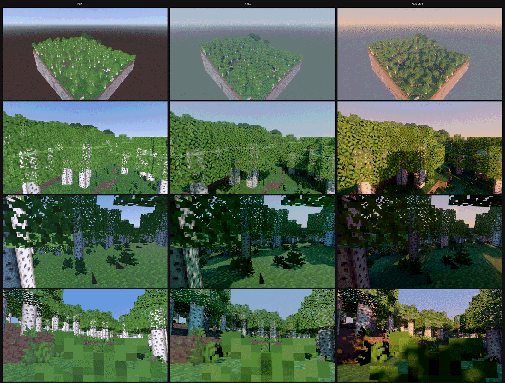
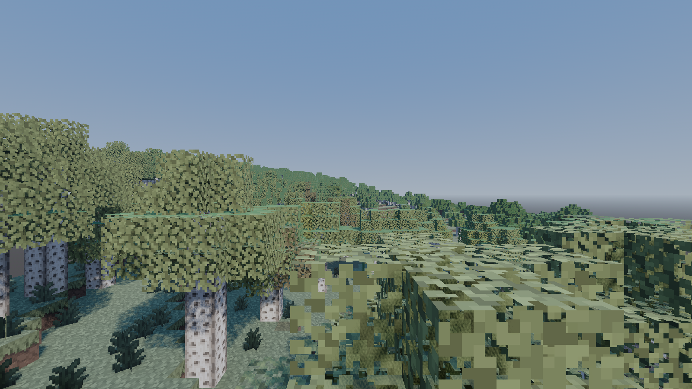

# Goanna

**A Godot 4 client for Luanti worlds.**

Goanna carries Luanti's own client logic into Godot as a GDExtension, and
renders it with Godot's Forward+ pipeline: PBR materials, SDFGI, SSAO and
SSIL, volumetric fog, real shadows. It connects to ordinary, unmodified
Luanti servers, over the ordinary protocol.

The idea is narrow. Luanti's worlds, games, mods and servers are the point;
Goanna changes nothing about them. It replaces one layer, the renderer, and
keeps the rest of the client as close to Luanti's own code as it can.

> Goanna is an independent project. It is not affiliated with, endorsed by
> or supported by the Luanti project. The name "Luanti" is used here only to
> identify the software Goanna interoperates with.

## What it is not

"Alt client" has meant cheat client in this community, so it is worth being
blunt about the boundaries. These are permanent, not temporary:

- Goanna asks a server for nothing a vanilla client does not ask for, and
  shows the player nothing the server did not send. No x-ray, no reach, no
  automation, no seeing through fog or darkness that the protocol did not
  hand over.
- Goanna does not modify servers, does not require a mod, and does not ship
  a game.
- Goanna does not fork Luanti. There is no patch queue against the engine.
  `luanti/` is a submodule pinned to a release tag and used as it is.
- The vanilla client is the reference. Where the two differ in behaviour,
  the vanilla client is right and Goanna has a bug.

Goanna is also not a replacement. It is Forward+ and Vulkan only, with no
low specification fallback, deliberately. If a machine cannot run it, the
machine should run the vanilla client, which will always be the one that
runs everywhere.

## Why

There is more in a Luanti world than a renderer has to work with. The same
nodes, the same textures and the same worldgen carry a lot of shape, and a
global illumination pipeline can find things in them that nobody had to
author.

Below is one scene from a Mineclonia world, rendered twice. Both images are
Godot. The left has the lighting turned off; the right has SDFGI, shadows,
ambient occlusion and colour grading turned on. Nothing else differs: same
geometry, same textures, no new art, no mod.

| Lighting off | Lighting on |
| --- | --- |
|  |  |



These come from an offline study (E0a in `PLAN.md`): a Mineclonia world was
exported to plain geometry and rendered in Godot, to find out whether the
payoff was real before committing to the work. They are **not** the live
client, and are labelled that way everywhere they appear. What the live
client renders today is further down, and it is not there yet.

## Status: pre-alpha, as at 16 August 2026

Goanna connects to a live server and you can walk around in it. That is the
honest summary. It is a spike that got far enough to be worth showing, not
software to play with yet.

**Working:**

- Connects to a Luanti 5.16.x server over the real protocol, with the real
  handshake and Luanti's own network layer compiled from the submodule.
- SRP authentication. Registers a new name, logs back in, and is correctly
  refused with a wrong password. The server logs an ordinary "joins game".
- Media transfer: announce, request, receive, zstd. Around 440 files from
  devtest in about a second, with `CLIENT_READY` held until they all land.
- Node and item definitions, and mapblocks streamed around the player, with
  `GOTBLOCKS` acknowledgements and periodic position updates.
- Meshing by Luanti's own `content_mapblock`, `mapblock_mesh` and
  `node_visuals`, transplanted, so nodes are built by the engine's own rules
  rather than an approximation of them. The resulting Irrlicht CPU meshes are
  converted to Godot arrays, one mesh per mapblock.
- The texture modifier language, `imagesource.cpp` transplanted, so tile
  strings with `^` composites, `[colorize`, crack and the rest resolve the
  way the server expects.
- Movement using Luanti's own `collision.cpp` and `localplayer.cpp`,
  transplanted nearly verbatim. Falling, landing, walking at the server's
  speed, jumping, stepping up, sneaking. `MOVEMENT` and `PRIVILEGES` are
  applied and `MOVE_PLAYER` teleports work.
- Node changes from the server. `ADDNODE` and `REMOVENODE` go through
  Luanti's own `Map::addNodeAndUpdate` and `removeNodeAndUpdate`, and the
  affected mapblocks are re-meshed. Verified with a devtest worldmod that
  toggles a stone pillar in front of the player every three seconds.
- The server's sky. `SET_SKY`, `SET_SUN`, `SET_MOON`, `SET_STARS`,
  `SET_CLOUD_PARAMS`, `SET_LIGHTING`, `OVERRIDE_DAY_NIGHT_RATIO` and
  `TIME_OF_DAY` are parsed; the sun follows Luanti's own path across the sky
  and drives Godot's directional light, the day, dawn and night sky colours
  blend the way the vanilla `Sky` does, and fog, saturation, exposure and
  bloom follow the server's lighting parameters
  (`docs/e0b_time_of_day.png`, Mineclonia at four times of day).
- Materials chosen by Luanti's own material type. Liquids get a water
  shader (vertex waves, refraction, low roughness), waving leaves and
  plants sway, alpha nodes such as glass get a refracting blend shader, and
  everything else is a `StandardMaterial3D` with nearest filtering and the
  node's alpha mode. Water, leaves and plants observed on devtest and
  Mineclonia; the glass shader has not been seen on a real node yet.
- Light-emitting nodes. Textures used only by nodes with `light_source` are
  rendered emissive, and a pool of `OmniLight3D`s follows the nearest bright
  nodes to the camera, so a torch or glowstone lights the ground around it
  and SDFGI picks up the bounce (`docs/e0b_torches_night.png`, a devtest
  ring of `light14` nodes at midnight). The nearest eight of those lights
  cast shadows.
- Digging and placing. The pointed-thing raycast is Luanti's own
  (`Environment::continueRaycast` transplanted, `raycast.cpp` compiled from
  the submodule), dig time comes from the tool capabilities, and
  `TOSERVER_INTERACT` start, stop, completed and place are sent with a
  client-side removal prediction and crack level. Wield slot by number keys
  and mouse wheel (`TOSERVER_PLAYERITEM`). Observed on devtest: instant dig
  of `testnodes:light14`, a timed hand dig of `basenodes:dirt_with_grass`,
  and two placements, all confirmed in the server log.
- Entities, partly. `ACTIVE_OBJECT_REMOVE_ADD` and `ACTIVE_OBJECT_MESSAGES`
  are handled by a transplant of `GenericCAO`'s state and message parsing
  (position and rotation interpolation, animation and bone data, attachment,
  physics overrides applied to the local player). Visuals are sprites, cubes
  and placeholders with nametags (`docs/e0b_entities.png`, a second player
  on devtest). Meshes and skeletal animation are not drawn yet.
- In-game data, without an interface to show it. Chat in both directions,
  HP and breath, HUD elements and flags, the inventory (Luanti's own
  `Inventory`), inventory and shown formspecs as strings, and item icons
  through the texture source are parsed and exposed to GDScript. See
  [docs/protocol-coverage.md](docs/protocol-coverage.md) for the packet by
  packet list and the `GoannaClient` API.
- Rendering through Godot's Forward+ pipeline, with SDFGI, SSAO, SSIL, real
  shadows, fog and AgX tone mapping.

**Not working yet.** This list is longer, and that is the point of showing
it:

- Node lighting proper. Luanti's baked vertex lighting is deliberately
  bypassed at the moment (`g_goanna_no_light` in `src/goanna_mesh_flags.h`),
  so apart from the point lights above, all light comes from Godot's sun,
  sky and global illumination. Caves are as bright as the surface.
  Reconciling Luanti's light data with a physically based renderer is an
  open design question, not just a missing feature.
- Transparent nodes are sorted per mapblock, not per triangle as Luanti
  does, so overlapping water and glass can draw in the wrong order.
- Entity meshes and skeletal animation, and `NDT_MESH` nodes. Anything with
  a model is a placeholder box for now.
- Any in-game user interface. Chat, HUD, inventory and formspecs arrive and
  are exposed to GDScript, but nothing draws them yet; formspec rendering
  in particular is a large piece of work. Wield item visuals, node metadata,
  the death screen. There is a connection menu and nothing else.
- Inventory actions (`TOSERVER_INVENTORY_ACTION`), sound, particles, the
  minimap, camera packets, mod channels, client-side mods.
- Clouds, and the sun, moon and star textures. The sky is a plain gradient.
- Windows and macOS. Linux only so far, for no better reason than that is
  where it was written.

What the live client renders today, connected to a Mineclonia server:




Those are Luanti's own meshing rules and Luanti's own textures, drawn by
Godot, over the ordinary protocol. Compare them with the offline study
further up: the geometry and materials have arrived, and the lighting has
not, because node light is still bypassed.

The earlier devtest images, for the record, are
[first light](docs/e0b_first_light.png) with no textures at all,
[textured](docs/e0b_textured.png), and
[after walking](docs/e0b_walking.png).

## Trying it

You will need Godot 4.5, a Vulkan capable GPU, a C++17 toolchain, and a
Luanti server to connect to.

```sh
git clone --recurse-submodules --shallow-submodules \
    https://github.com/p0ss/Goanna.git goanna
cd goanna
cmake -S . -B build -G Ninja -DCMAKE_BUILD_TYPE=RelWithDebInfo
cmake --build build

# Once, so Godot registers the extension. It writes
# project/.godot/extension_list.cfg, which is gitignored and which a plain
# run will not create for you. It currently crashes on exit; that is a known
# bug and the file is written first.
/path/to/Godot_v4.5.1-stable_linux.x86_64 --headless --editor --quit --path project
```

Then start any ordinary Luanti server and run Goanna:

```sh
luantiserver --gameid devtest --worldname goanna_test --port 30000

/path/to/Godot_v4.5.1-stable_linux.x86_64 --path project
```

A small menu asks for the server address, port, player name and password,
remembers everything but the password, and connects. To skip the menu, give
the connection details in the environment instead:

```sh
GOANNA_HOST=127.0.0.1 GOANNA_NAME=goanna GOANNA_PASS=hunter2 \
  /path/to/Godot_v4.5.1-stable_linux.x86_64 --path project
```

W A S D to walk, mouse to look, space to jump, F for a free camera, escape
to release the mouse.

Full instructions, including dependencies for common distributions, the
environment variables and a troubleshooting list, are in
**[docs/building.md](docs/building.md)**.

## How it works

Luanti's client is not as entangled with its renderer as it looks. Outside
`src/client` and `src/gui`, the engine barely touches Irrlicht at all. That
makes a transplant plausible where a rewrite would not be.

So Goanna takes Luanti's client logic, the networking, world handling,
movement prediction, node meshing rules and formspec parsing, and replaces
only what Irrlicht used to provide: rendering, GUI widgets, mesh loading,
input and the window. Parity with vanilla movement and formspecs is not
something Goanna has to chase, because it is the same code.

In practice that means three tiers:

1. **Compiled from the submodule, untouched.** The network layer,
   serialisation, node and item definitions, MapBlock and Map, inventory and
   metadata, the SRP stack. About fifty files, listed in
   `cmake/luanti_core.cmake`, compiled into a static library and linked with
   `--no-undefined`.
2. **Copied into `src/transplant/`, minimally changed.** Only files that
   cannot compile as they are, because they reach for the Irrlicht renderer
   or for a `Client` that Goanna does not have. Each keeps its upstream
   copyright header, gains a note saying what changed, and is listed in an
   inventory table.
3. **Goanna's own code.** The Godot side: meshes, materials, textures, the
   session thread, the extension entry point.

The rule is that tier 2 stays as small as possible, because tier 2 is what
has to be re-applied at every Luanti release. The discipline, the inventory
and the upstream tracking procedure are in
**[docs/transplanting.md](docs/transplanting.md)**.

## Where it is going

`PLAN.md` has the full plan and the reasoning behind it. The short version
is a compatibility ladder:

1. A plain game and devtest: mapblocks, movement, basic nodes. **In
   progress.**
2. minetest_game, the classic baseline.
3. Mineclonia and VoxeLibre: B3D models, the full formspec corner case zoo,
   particles, attachments. This is the bar for being usable by the
   community, and the games people actually play.
4. Server sent client side modding, mirroring upstream when it lands.

## Contributing

Build reports from machines that are not the author's are the most useful
thing right now, along with review of the transplant discipline. See
**[CONTRIBUTING.md](CONTRIBUTING.md)**.

Text in this repository follows a house style: Australian English, no em
dashes, plain factual tone. It is written down in
[docs/style.md](docs/style.md) and checked by `tools/check-style.sh`.

## Licence

Copyright (C) 2026 the Goanna contributors.

Goanna is free software: you may redistribute it and modify it under the
terms of the GNU Lesser General Public Licence as published by the Free
Software Foundation, either version 2.1 of the licence or, at your option,
any later version. This matches the Luanti client code Goanna carries. The
full text is in [LICENSE](LICENSE). There is no warranty.

Contributors keep their copyright. There is no contributor licence agreement
and no copyright assignment.

The built extension also links mini-gmp, which is LGPL-3.0-or-later or
GPL-2.0-or-later, so a distributed binary is effectively LGPL-3.0-or-later.
That is the same combination upstream Luanti's own builds contain.
godot-cpp is MIT. The full accounting, including the acknowledgements that
binary distribution requires, is in
**[THIRD-PARTY.md](THIRD-PARTY.md)**.

Screenshots show media from Luanti's Development Test game and from
Mineclonia, which are covered by their own licences. See THIRD-PARTY.md.

## Credit

Goanna is mostly Luanti's code. The networking, the world model, the
physics, the meshing rules and the protocol are the work of celeron55 and
everyone who has contributed to Luanti since 2010. Goanna moved some of it
into a different renderer, which is the easy part.
