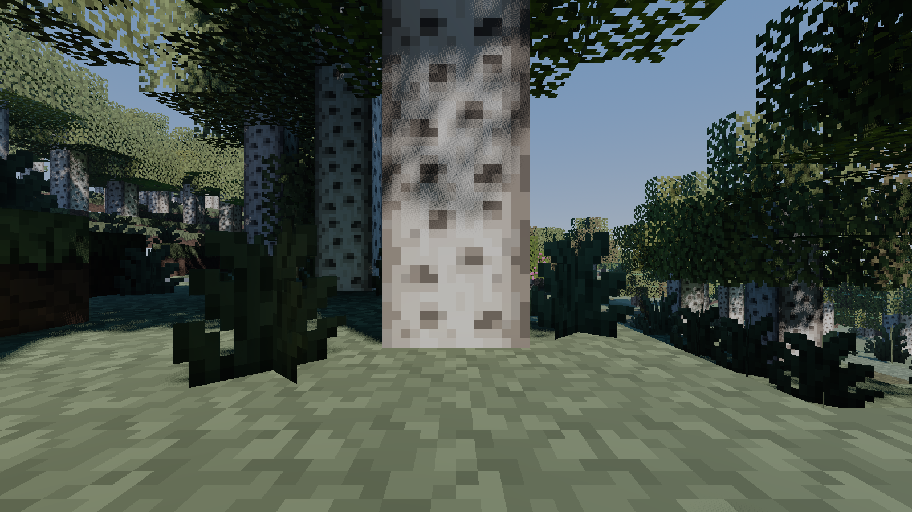
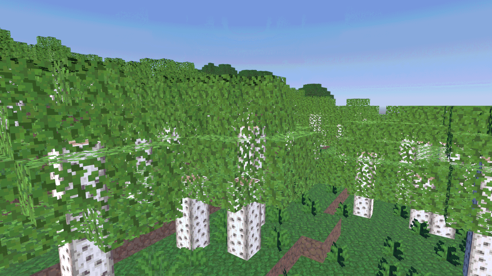
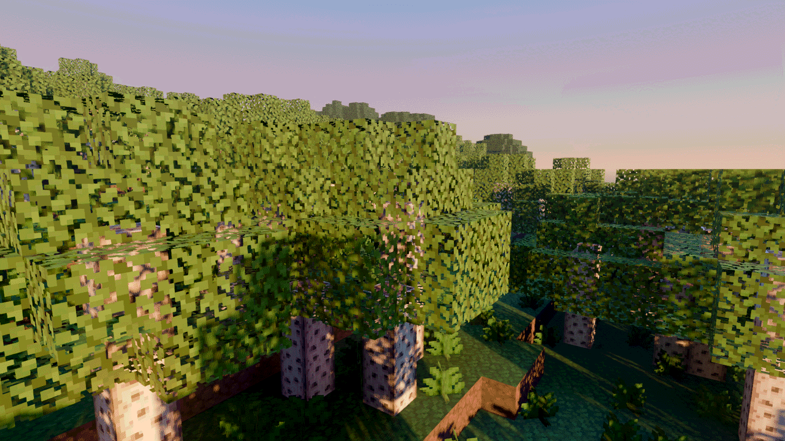
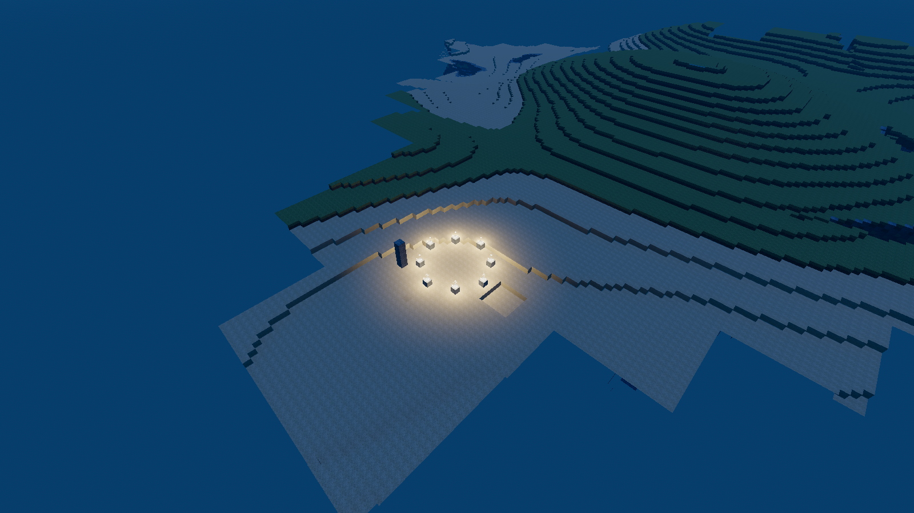
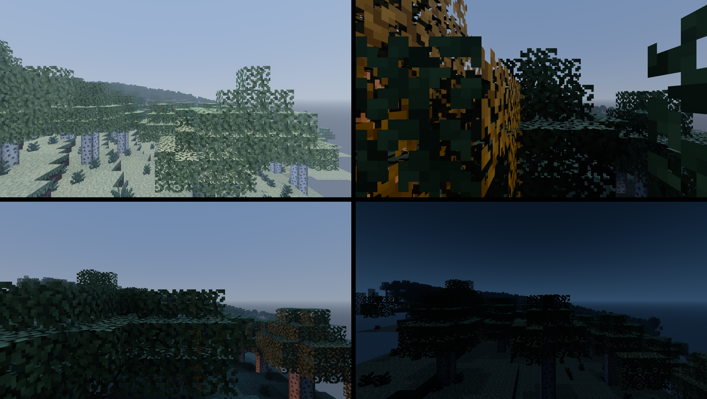
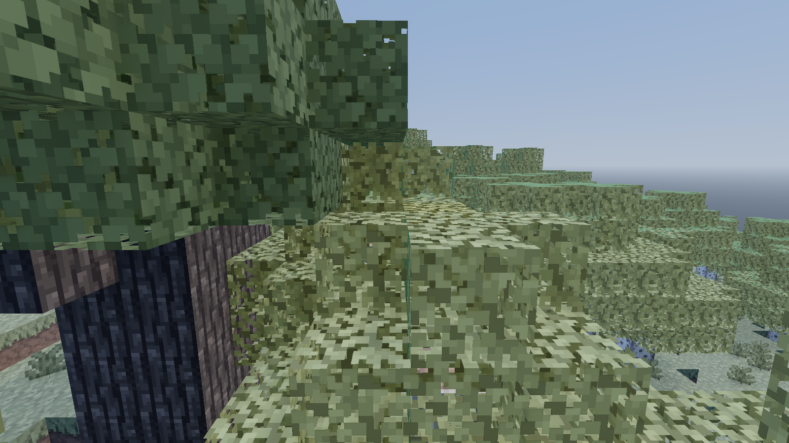

# Goanna

**A different way to look at Luanti worlds.** Same servers, same games, same
worlds, drawn with a modern game renderer.



## What is this?

[Luanti](https://www.luanti.org/) is a free and open source voxel game
engine, the one that used to be called Minetest. People build games on it,
run public servers, and play them with Luanti's own client.

Goanna is a second client for those same servers. You log in with the same
name, to the same worlds, playing the same games. Luanti calls the cubes a
world is made of *nodes*, and so does the rest of this page. Nothing about the server
changes, and nothing about the game changes. The only difference is what
happens on your screen.

The reason it exists is that a Luanti world already contains more than its
renderer can show. Sunlight through a canopy, light bouncing off a coloured
wall, soft shadow in a doorway: the shapes and the textures are all there
already, and a modern renderer can find things in them that nobody had to
build. Goanna hands the world to [Godot 4](https://godotengine.org/) and
lets it do that.

Here is the same patch of forest with the lighting off and on. Same nodes,
same textures, no new art:

| Lighting off | Lighting on |
| --- | --- |
|  |  |

That pair is from an early test, rendered offline rather than by the client,
so treat it as the target rather than the current state. The picture at the
top of this page is the real thing.

## Can I play it yet?

Almost, and that sentence is newer than this paragraph deserves.

You can connect to an ordinary server, walk around, dig and place, chat,
watch your health and hunger bars, open your inventory and read the game's
own menus. What you cannot do yet is drag an item from one slot to another.
That one gap rules out crafting, which rules out playing most games through
to anything. Players and mobs are also still coloured boxes, because nothing
loads their models yet.

So: worth a look, worth a screenshot, not yet worth moving into. The Luanti
client remains the one that works, and will always be the one to compare
against.

**If you want to follow along**, the pictures in [docs/](docs/) get updated
as things land, and `PLAN.md` says where it is heading.

**If you want to try it**, see below. You will need to build it yourself,
on Linux, for now.

**If you want to help**, [CONTRIBUTING.md](CONTRIBUTING.md) says what would
actually be useful right now. Short version: build it on a machine that is
not the author's and tell us what broke.

## Trying it

You need Godot 4.5, a graphics card that can run Vulkan, a C++ toolchain,
and a Luanti server to connect to.

```sh
git clone --recurse-submodules --shallow-submodules \
    https://github.com/p0ss/Goanna.git goanna
cd goanna
cmake -S . -B build -G Ninja -DCMAKE_BUILD_TYPE=RelWithDebInfo
cmake --build build
```

Then start any ordinary Luanti server and run the project. A menu asks for
the address, name and password:

```sh
luantiserver --gameid devtest --worldname goanna_test --port 30000
/path/to/Godot_v4.5.1-stable_linux.x86_64 --path project
```

W A S D to walk, mouse to look, space to jump, left and right mouse to dig
and place, number keys to change item, I for the inventory, T to chat, F for
a free camera, escape for the pause menu.

There is one extra step the first time, and a couple of known rough edges.
Full instructions, dependencies for common distributions and a
troubleshooting list are in **[docs/building.md](docs/building.md)**.

## What works, and what does not

As at 16 August 2026. Pre-alpha, and moving quickly.

**Works.** Connecting and logging in to ordinary servers. The world itself:
terrain, plants, water, glass and every other node shape, built by Luanti's
own rules so nodes look the way the game intended. Walking, jumping,
sneaking and falling, at the server's speeds. Digging and placing, with the
right tool timings. The sky, the sun and moon, day and night. Torches and
other glowing nodes that actually light the room. Nodes appearing and
disappearing as other players change the world.

And, as of today, an interface: crosshair and hotbar with item icons and
wear, the health, breath, hunger and experience bars the server sends, chat
in both directions with history, your inventory and the game's own menus
drawn from its formspecs, a pause menu and a death screen.

**Does not work.** Moving items between inventory slots, so no crafting.
Models, so players, mobs and dropped items are placeholder boxes and model
nodes are missing. Underground lighting, so caves are as bright as the
surface. Sound. Particles. Clouds. Windows and macOS.

| Torches at midnight | Mineclonia through the day | Water and leaves |
| --- | --- | --- |
|  |  |  |

More, including [players and mobs as placeholders](docs/e0b_entities.png),
[the view over a Mineclonia canopy](docs/e0b_mineclonia_mesher.png) and the
[lighting comparison sheet](docs/e0a_contact_sheet.png), are in
[docs/](docs/).

A packet by packet breakdown, for the curious, is in
[docs/protocol-coverage.md](docs/protocol-coverage.md).

## Is it official? Is it cheating?

Neither.

> Goanna is an independent project. It is not affiliated with, endorsed by
> or supported by the Luanti project. The name "Luanti" is used here only to
> identify the software Goanna interoperates with.

On cheating, the boundaries are permanent rather than a current limitation.
Goanna asks a server for nothing that Luanti's own client does not ask for,
and shows you nothing the server did not send. No seeing through walls, no
extra reach, no automation, no peering through darkness the game meant you
not to see. It does not modify servers, does not need a mod, and does not
ship a game of its own. Anything that would give a Goanna player an
advantage over anyone else is out of scope for good.

That matters because "alt client" has usually meant "cheat client" around
here, and this one is not going to blur the line.

---

# For developers

## How it works

Luanti's client is less tangled up in its renderer than it looks. Outside
`src/client` and `src/gui`, the engine barely touches Irrlicht at all, which
makes a transplant plausible where a rewrite would not be.

So Goanna carries Luanti's client logic across, the networking, world
handling, movement prediction and node meshing rules, and replaces only what
Irrlicht used to provide: rendering, widgets, model loading, input and the
window. Parity with vanilla movement is not something Goanna has to chase,
because it is running the same code.

That happens in three tiers:

1. **Compiled from the submodule, untouched.** The network layer,
   serialisation, node and item definitions, MapBlock and Map, inventory,
   the SRP stack. About fifty files, listed in `cmake/luanti_core.cmake`.
2. **Copied into `src/transplant/`, changed as little as the compiler
   allows.** Only files that cannot build as they are. Each keeps its
   upstream copyright header, gains a note saying what changed, and appears
   in an inventory table.
3. **Goanna's own code.** The Godot side, plus the session thread.

Tier 2 is kept deliberately small, because tier 2 is what has to be
re-applied at every Luanti release. The rules, the inventory and the
upstream tracking procedure are in
**[docs/transplanting.md](docs/transplanting.md)**.

Goanna does not fork Luanti and there is no patch queue against the engine.
`luanti/` is a submodule pinned to a release tag, currently 5.16.1.

## Where it is going

`PLAN.md` has the full plan. The short version is a compatibility ladder:

1. A plain game and devtest: nodes, movement, basic interaction. **In
   progress.**
2. minetest_game, the classic baseline.
3. Mineclonia and VoxeLibre: models, the full formspec corner case zoo,
   particles, attachments. This is the bar for being usable by the
   community, and the games people actually play.
4. Server sent client side modding, mirroring upstream when it lands.

The largest single piece of work between here and rung 3 is model loading
and skeletal animation, which is what stands between placeholder boxes and
recognisable players, mobs and node models.

## Contributing

Build reports from machines that are not the author's are the most useful
thing right now, along with review of the transplant discipline. See
**[CONTRIBUTING.md](CONTRIBUTING.md)**.

Text in this repository follows a house style: Australian English, no em
dashes, plain factual tone. It is written down in
[docs/style.md](docs/style.md) and checked by `tools/check-style.sh`.

## Licence

Copyright (C) 2026 the Goanna contributors.

Goanna is free software: you may redistribute it and modify it under the
terms of the GNU Lesser General Public Licence as published by the Free
Software Foundation, either version 2.1 of the licence or, at your option,
any later version. This matches the Luanti client code Goanna carries. The
full text is in [LICENSE](LICENSE). There is no warranty.

Contributors keep their copyright. There is no contributor licence agreement
and no copyright assignment.

The built extension also links mini-gmp, which is LGPL-3.0-or-later or
GPL-2.0-or-later, so a distributed binary is effectively LGPL-3.0-or-later.
That is the same combination upstream Luanti's own builds contain. godot-cpp
is MIT. The full accounting, including the acknowledgements that binary
distribution requires and the licences on the game media in these
screenshots, is in **[THIRD-PARTY.md](THIRD-PARTY.md)**.

## Credit

Goanna is mostly Luanti's code. The networking, the world model, the
physics, the meshing rules and the protocol are the work of celeron55 and
everyone who has contributed to Luanti since 2010. Goanna moved some of it
into a different renderer, which is the easy part.
