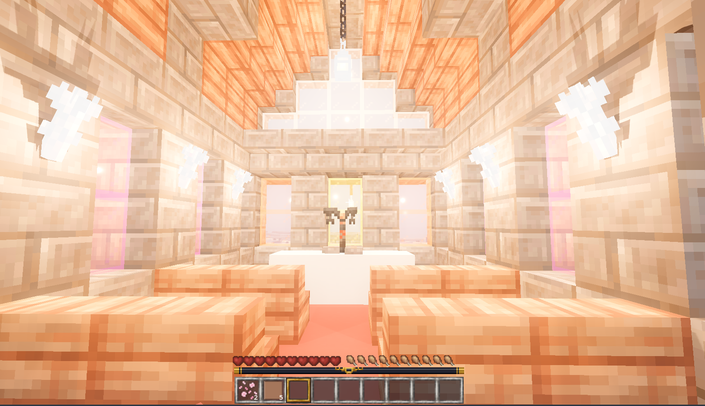
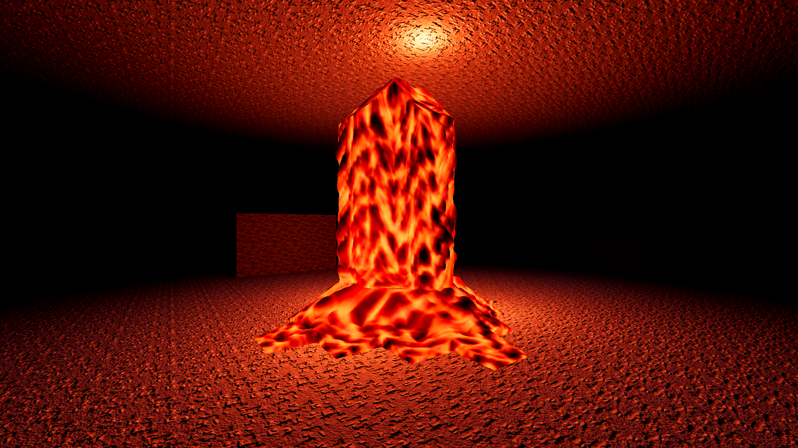

# Goanna

Goanna is a game client for [Luanti](https://www.luanti.org/), the voxel
game engine formerly called Minetest. It is a standalone program built on
the Godot engine, not a plugin for either: it speaks Luanti's own network
protocol to unmodified servers and plays the same games, worlds and rules,
and draws them with a renderer of its own.

It is alpha quality. The Luanti client remains the reference for
compatibility and reliability.


| Landscapes | Lighting and materials |
| --- | --- |
|  |  |
|  |  |

## What it draws

- **Distant terrain.** Several tiers of simplified terrain beyond the live
  view, built from server summaries and a local store of every block
  received, with occlusion culling, so the view runs on to the horizon well
  past the range the server streams in full.
- **Dynamic lighting.** Sun and moon with cascaded shadows, lamps that cast
  their own shadows, bounced light (SDFGI) and screen space indirect light
  and occlusion, a sky and clouds that follow the time of day.
- **PBR materials.** LabPBR normal and material maps for any game, and a
  hand authored set for Mineclonia's 1071 textures that keeps the pixel art's
  grid: each texel a crisp raised or sunken plate with its own material, and
  fine surface character (pores, grain, scratches) below it.
- **Parallax occlusion.** Terrain surfaces march their height map, with self
  shadowing, so joints and relief have depth rather than painted shading.
- **Sub-block destruction.** Digging carves a block's own shape, a slab or
  a stair as well as a cube, and a carve can be stored and seen by every
  player.
- **Shaders.** Water with refraction and wakes round swimmers, lava, ice,
  glass, a ray marched grass volume, and weather drawn by shader: rain and
  snow kept out from under roofs, splashes, puddles that fill the relief and
  lightning.
- **Terrain Diffusion.** Optional worlds shaped by a terrain diffusion
  model, with a downloadable default bake at one metre per node.
- **Controllers.** Gamepad play and menus, written and tested with
  synthetic input only; it has not yet been played on a controller or a
  Steam Deck.

Beyond the renderer it is a full client: movement, interaction, inventory,
formspecs, entities, sounds and particles as the server sends them, menus
on translucent glass or in each game's own form art, local games hosted
through an ordinary Luanti server, optional hash verified material bundles,
and an experimental Iris screen space shader pack pipeline.

## Try it

Goanna currently targets Linux, Godot 4.5 and a Vulkan-capable GPU. Luanti is
needed to start a local game; it is not needed when joining a remote server.

```sh
git clone --recurse-submodules --shallow-submodules \
  https://github.com/p0ss/Goanna.git goanna
cd goanna
cmake -S . -B build -G Ninja -DCMAKE_BUILD_TYPE=RelWithDebInfo
cmake --build build
/path/to/Godot_v4.5.1-stable_linux.x86_64 --path project
```

The menu provides Start Game, Join Game, Content, Settings and About. See
[the player guide](docs/play/index.md) for controls, requirements, Terrain
Diffusion downloads and current limitations. See
[the developer guide](docs/develop/index.md) to build, test or extend Goanna.

## Compatibility and scope

Goanna does not modify servers and does not grant abilities by default. It
requests and displays no more than a normal client unless a server explicitly
enables an optional Goanna capability. It is not affiliated with or endorsed
by Luanti.

The most thoroughly tested game is Mineclonia. Other Luanti games and servers
may work, but the long tail of node drawtypes, animated textures, particles,
formspecs and item models is still incomplete. Windows and macOS are not
currently play-tested.

Game controller support is in the code but has not been played with a
controller, on a Steam Deck or anywhere else; only headless tests with
synthetic events on Godot 4.5.1 have run. See
[docs/play/controllers.md](docs/play/controllers.md).

## Documentation

The documentation is a site, published at
<https://p0ss.github.io/Goanna/> and built from [`docs/`](docs/index.md):

- [Play](docs/play/index.md): installing, starting and joining, controls,
  settings, accessibility and current limitations.
- [Host](docs/host/index.md): running a server for Goanna players and the
  optional server mod.
- [Develop](docs/develop/index.md): building, testing, benchmarks, style
  and the transplant discipline.
- [Agents](docs/agents/index.md): the interfaces for coding agents and the
  AI game master. The agent rules are in [AGENTS.md](AGENTS.md).
- [Systems](docs/systems/index.md), [design](docs/design/index.md) and
  [history](docs/history/index.md): how each part works, the plans, and the
  dated record.
- [Releases](docs/releases/index.md): release notes.

## Contributing and licence

Build reports from machines other than the author's, compatibility reports,
focused tests and reviews of the Luanti transplant boundaries are especially
useful. See [CONTRIBUTING.md](CONTRIBUTING.md) and
[docs/develop/style.md](docs/develop/style.md).

Goanna is LGPL-2.1-or-later, except where a texture pack notes otherwise:
the packs under `pbr_packs/` and the asset bundles built from them are
derivative works of game media and carry that media's licence (CC BY-SA, CC0
or GPL-3.0, per file), recorded in each pack's `ATTRIBUTION.md`. The complete
dependency and media accounting is in [THIRD-PARTY.md](THIRD-PARTY.md).
