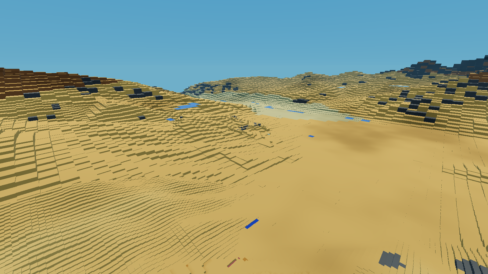
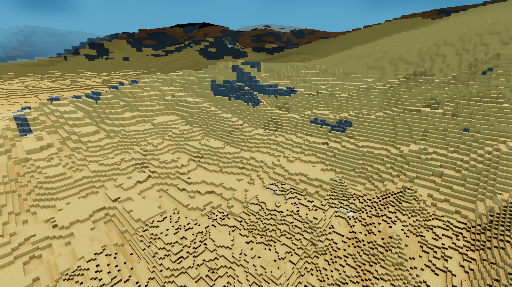

# Baked terrain surface review

TDL now supplies a coarse land and water surface directly from its existing
bake, without waiting for mapblocks to generate. The client fills the whole
granted radius before requesting finer samples. Old surface geometry stays
visible until its replacement has uploaded. Visited voxel terrain can still
replace the bake, including at distant locations.

This is an implementation and loading review, not a finished transition or
art-direction pass. It reads the existing bake on the server and persists
the resulting tiles. An additional offline TDL surface export is not part
of this change. See the [implementation contract](../../baked-terrain.md).

## Live fixture

These captures use the disposable Asuna Terrain Diffusion copy of `fdsea`
at `/tmp/goanna-horizon-shore/world`, on local server port 30564. The
original world was not changed. The fixture uses Luanti 5.17.0 and Godot
4.5.1, Vulkan Forward+, an RTX 3090, eight mesh workers and the ultra
profile. The final server grant and client distance are both 8,192 nodes.
No texture pack is selected. Noon and the camera angles are held fixed;
clouds continue to evolve.

The provider revision is
`ca6b0fd2aa2d068284e7ea7a7ae8e0aa40d9bfd6`. Restarting the server retained
that identity and reused its persisted tiles. Native block and shader
caches were already populated by previous visits; this is not a cold
installation benchmark.

## Settled views

The [panorama](panorama.png) is at `(2643, 1250, -2031)`, pitch -20 and
yaw 135. The first-person arm is temporarily hidden. Output is 1600 by
900 at approximately 110 degrees diagonal FOV. Land now covers the valley
to the granted limit instead of waiting for distant chunk summaries.
Large terraces and resolution boundaries remain visible.

At this settled view, the published surface contained 85,641 quads and
reported 8,192 nodes of coverage. Total visible primitives were 82,468.
Surface requests, uploads and retired meshes were all zero, with no
surface build, LOD build or mesh worker running. Storage processing errors
were zero. These are static counters, not performance comparisons.
The [capture state](panorama.json) and [render counters](panorama-render.json)
are saved alongside the image.

The [ridge view](ridge.png) uses the previously accepted above-ground
camera, `(643.0611, 530.8826, -31.1183)`, pitch -20 and yaw 310.49.
It is captured after streaming settles. It is provided as a second
viewpoint, without presenting earlier runs with different coverage as a
controlled before/after comparison.

The user resumed exploring after the captures. The later
`ridge-render.json` snapshot includes renewed terrain work and is not a
settled measurement paired with the ridge image. No camera moves were
made after the user said they were exploring.

## Loading and flight

The [loading observations](loading.json) measure from processing the
surface capability to publishing a complete coarse radius:

| Run | First surface | Full coarse radius |
| --- | ---: | ---: |
| Initial 4 km pass, cold surface cache | 0.27 s | 2.83 s |
| 8 km extension, partly cached | 0.28 s | 7.80 s |
| Final 8 km pass, cached restart | 0.21 s | 1.90 s |

The first two runs used earlier versions of this pass. They establish
loading behaviour during development, not controlled comparisons between
distances. Coarse coverage does not mean every finer tile has arrived.

The final flight covered 2,833 nodes at 80 nodes per second, from
`(643, 700, -31)` to `(2643, 850, -2031)`. Its 45-second recording includes
movement and a short stationary tail. The screenshot was taken after
the timed recording, so PNG capture does not enter the frame timings.

| Frame time | Final 8 km flight |
| --- | ---: |
| Median | 3.40 ms |
| 99th percentile | 24.64 ms |
| 99.9th percentile | 43.85 ms |
| Worst | 104.97 ms |

Every one-second observation reported 8,192 nodes of published surface
reach. The tile cache stayed bounded at 512 entries. Retained old mesh
nodes peaked at 147 in the samples and drained to zero after settling.
Up to 161 replacement chunks waited for upload; the preceding publication
continued to draw. Raw [flight timings](flight-summary.json) and
[one-second observations](observations.jsonl) are included. Hitches remain;
this does not establish that flight stutter is solved or compare it to
an equivalent old-renderer run.

## Remaining limits

- Unexplored surfaces contain baked ground and water, without trees,
  buildings, cave mouths or overhangs. Those need voxel data.
- Coarse steps, material changes and near/far transitions are conspicuous.
  Coverage masks derive from voxel columns and are not exact geometric
  seams for every edited cliff or cave.
- The field ends at the server's permitted distance. Very high viewpoints
  can still reveal that finite extent.
- Individual bake reads, ordinary voxel work and mesh publications can
  still cause hitches. This pass removes the need to generate distant
  chunks just to display their base terrain.

## Checks

The native surface, LOD, horizon and LOD storage tests pass. The Lua server
test passes for request limits, grants, duplicate collapse, revision
invalidation and persisted cache reuse. The local-server rendering test
passes, including generated launch settings. The final client started
without script parse errors and completed the live flight and captures.

Repository style and diff checks pass. The reusable capture script is
`tools/terrain-baked-review.py`; the bounded protocol and publication
details are recorded in the implementation contract.
