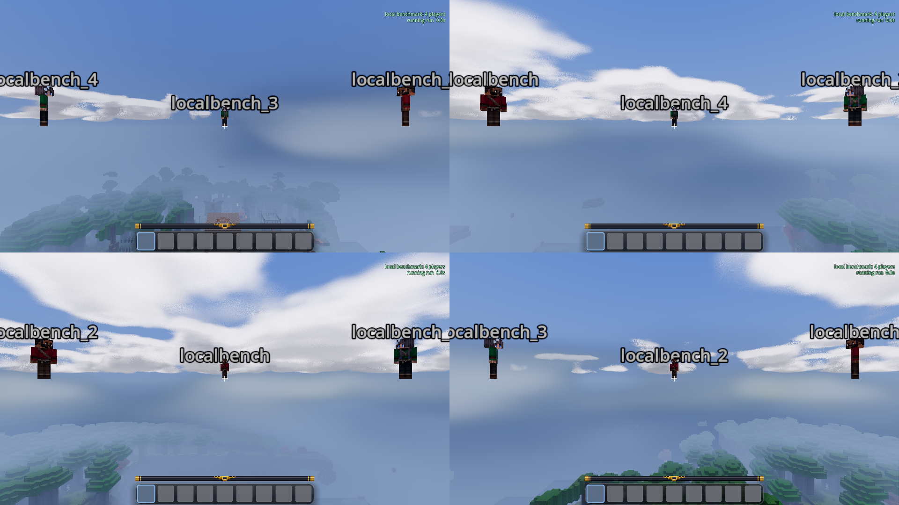
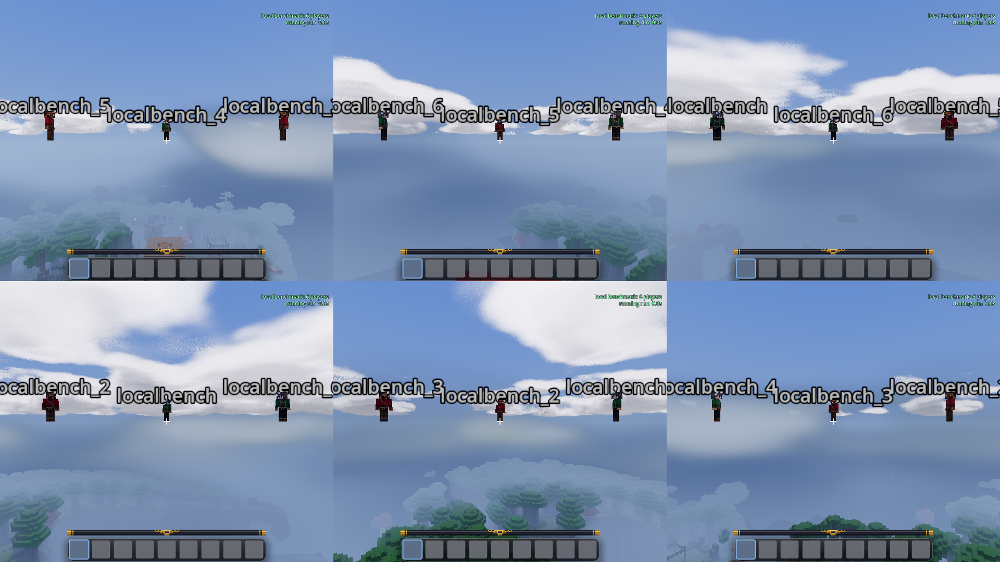

# Local multiplayer benchmark, 2026-09-27

Four and six local players rendered successfully in one Godot process.
Stationary performance was usable on this desktop; simultaneous terrain
streaming reduced frame rates substantially. Client RAM grew by roughly
1.4 GiB per additional player over the two-to-six-player range. The GPU's
24 GiB memory capacity was not approached.

## Setup

- AMD Ryzen 7 7800X3D, NVIDIA RTX 3090, approximately 62.5 GiB system RAM.
- Godot 4.5.1, Forward+ Vulkan renderer; Luanti 5.17.0 server; installed
  Mineclonia ContentDB release 38561.
- Total output 1920 by 1080, current Low profile, default game textures,
  no installed PBR pack. Uncapped, vsync disabled.
- One client process inside headless gamescope at a time. Its optional
  Vulkan WSI layer was disabled after a swapchain-layer startup error.
- Independent Luanti connection, world and viewport per local player.
  Two players have 960 by 1080 views, four 960 by 540, six 640 by 540.
- Fresh client data and an identical disposable world copy per trial.
  The source was the existing `test_world`, including its existing world
  mods. A fixture grants ordinary teleport/fly privileges and sets spawn.
- Counts 1, 2, 4, 6, then 1 again. Every workload records for 45 seconds.
  Both stationary workloads passed the settling check for every trial.
- The working tree contains uncommitted architecture and benchmark changes.
  Build/source hashes and the Git base are in [metadata.json](metadata.json).

## Workloads

**Circle:** players occupy an eight-node-radius circle, facing its centre
at Godot coordinates `(-72, 64, 378)`. Cameras are held aloft in fly mode.
Other players are visible and the views include sky and nearby terrain.
This is not a ground-level walking or combat benchmark.

**Separate areas:** players sit 192 nodes from the same centre, evenly
spaced around it, looking outwards and down towards terrain. Their scenes
vary; this measures a plausible local-play workload, not identical geometry
multiplied by the number of players.

**Streaming:** from those separate positions, every camera travels outwards
at eight nodes per second for about 360 nodes, at fixed altitude 64.
Routes use elapsed time, so slower frame rates do not shorten the route.
The screenshots show different terrain in the views. This is simultaneous
flight through new terrain, not a claim about ordinary walking performance.

## Results

Mean FPS is frames divided by elapsed time. RAM is peak client process RSS
across these recordings; it excludes the separate server and compositor.
The single-player row is the first run; its repeat appears below.

| Players | Circle FPS | Separate FPS | Streaming FPS | Peak client RAM, GiB |
| --- | ---: | ---: | ---: | ---: |
| 1 | 335.2 | 347.6 | 217.5 | 3.02 |
| 2 | 175.7 | 217.0 | 94.7 | 4.62 |
| 4 | 80.3 | 113.1 | 34.2 | 7.45 |
| 6 | 50.8 | 73.3 | 22.1 | 10.27 |

Frame times below are milliseconds. The 1% column is the mean of the slowest
1% of frames, not the 99th percentile. High mean FPS can hide these stalls.

| Players | Workload | Median | Slowest 1% mean | Worst frame | Renderer CPU median | Summed GPU median |
| --- | --- | ---: | ---: | ---: | ---: | ---: |
| 1 | Circle | 2.89 | 4.23 | 5.37 | 0.55 | 2.44 |
| 1 | Separate | 2.63 | 8.05 | 57.33 | 0.48 | 2.49 |
| 1 | Streaming | 3.09 | 54.58 | 1168.18 | 0.51 | 2.64 |
| 2 | Circle | 5.56 | 7.76 | 10.17 | 1.20 | 3.63 |
| 2 | Separate | 4.45 | 13.21 | 64.71 | 0.92 | 3.95 |
| 2 | Streaming | 8.28 | 51.28 | 75.75 | 1.08 | 4.13 |
| 4 | Circle | 12.19 | 18.93 | 39.12 | 2.58 | 6.14 |
| 4 | Separate | 8.59 | 21.55 | 58.36 | 1.91 | 6.38 |
| 4 | Streaming | 27.01 | 106.77 | 549.17 | 3.07 | 6.08 |
| 6 | Circle | 19.23 | 28.73 | 31.64 | 4.05 | 7.43 |
| 6 | Separate | 13.02 | 44.09 | 107.15 | 2.97 | 7.47 |
| 6 | Streaming | 43.77 | 107.61 | 123.36 | 4.66 | 12.89 |
| 1 repeat | Circle | 2.84 | 4.49 | 13.66 | 0.55 | 2.38 |
| 1 repeat | Separate | 2.56 | 7.06 | 52.48 | 0.46 | 2.46 |
| 1 repeat | Streaming | 3.04 | 51.12 | 1177.79 | 0.51 | 2.54 |

## Control repeat

The median-frame-time drift between the first and last single-player runs
was:

- together: -2.0% median; mean FPS 335.2 to 344.3.
- apart: -2.6% median; mean FPS 347.6 to 366.1.
- streaming: -1.3% median; mean FPS 217.5 to 222.8.

This is one repeat, not a confidence interval. It supports the large
player-count differences, not claims about small changes. Single-player
streaming itself has severe outliers, so multiplayer did not introduce all
of the observed hitching.

## Interpretation and limits

Four players around the circle averaged 80 FPS; six averaged 51 FPS.
However, concurrent streaming averaged only 34 and 22 FPS respectively,
with slowest-1% frame means around 107 ms for both. Smooth exploration needs
more work before either count is a general performance promise.

For four players while streaming, the median full-frame interval was 27 ms,
against approximately 6 ms of summed viewport GPU work and 3 ms of measured
renderer CPU work. For six it was 44 ms, against 13 ms GPU and 5 ms renderer
CPU. This suggests prioritising main-thread/session/terrain work and
profiling stalls before reducing pixel resolution. The timers do not prove
which specific subsystem is responsible, and their work totals are not
independent wall-clock GPU measurements.

The client RSS peaks were 7.45 GiB for four and 10.27 GiB for six. These
exclude the server and the rest of the desktop. Shared immutable assets,
terrain-resource reuse where protocol ownership permits it, and a common
memory budget are worth investigating. Their savings have not been measured.

Whole-GPU memory stayed below 4 GiB during the recorded samples, including
the desktop and gamescope. Godot's video-memory estimates are lower and do
not account for every driver allocation. This desktop result does not
predict performance on integrated graphics or another graphics profile.

The four- and six-player circle and end-of-flight compositions were visually
inspected. They show distinct views and loaded terrain. No script, shader
or engine errors were found in the five completed client logs. Player name
labels are oversized at these viewport sizes. Real-controller comfort,
audio mixing, menus and interacting while moving were not tested here.

## Captures and data

[Four-player flight](02-4p-streaming.png) and
[six-player flight](03-6p-streaming.png) show the final streaming views.

[measurements.json](measurements.json) contains the combined numeric rows.
Each numbered trial directory preserves frame CSVs and per-player samples
(compressed), summaries, hardware samples and settling snapshots. Full
logs, all screenshots and disposable worlds remain under
`/tmp/goanna-local-bench-circle-20260927` on the test machine.

Earlier overlapping-camera runs and the failed WSI-layer launch are excluded.
The repeat and all reported counts use the inward-facing circle arrangement.
