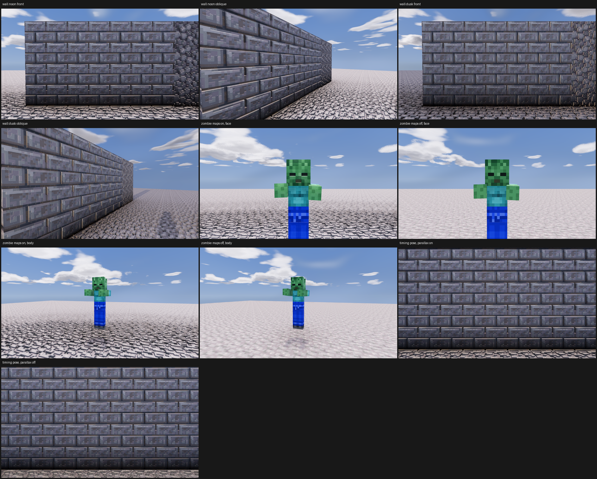
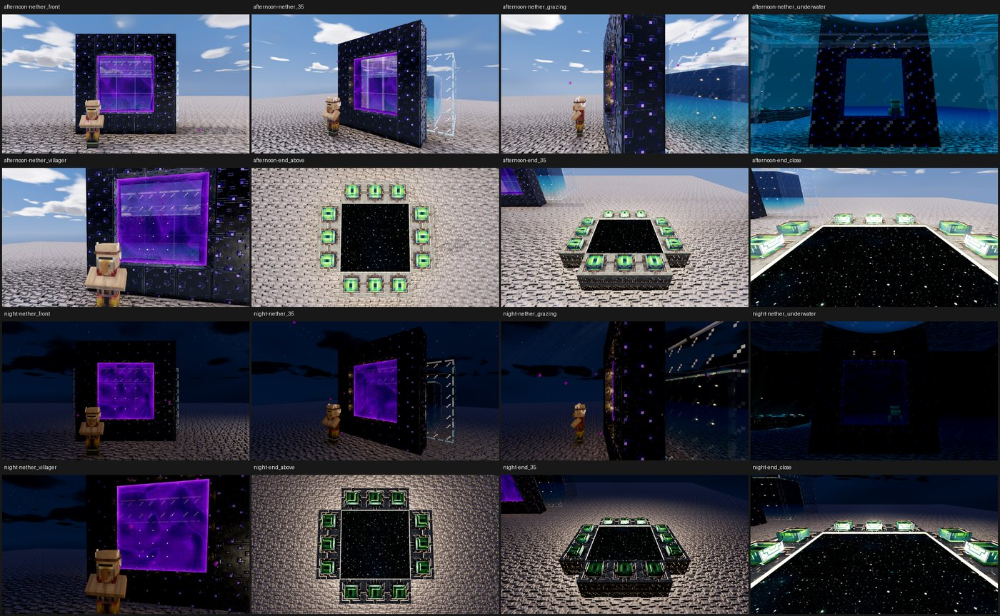
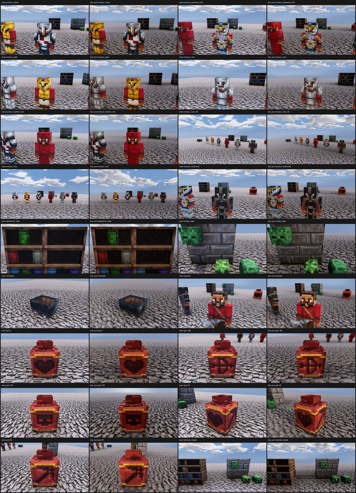
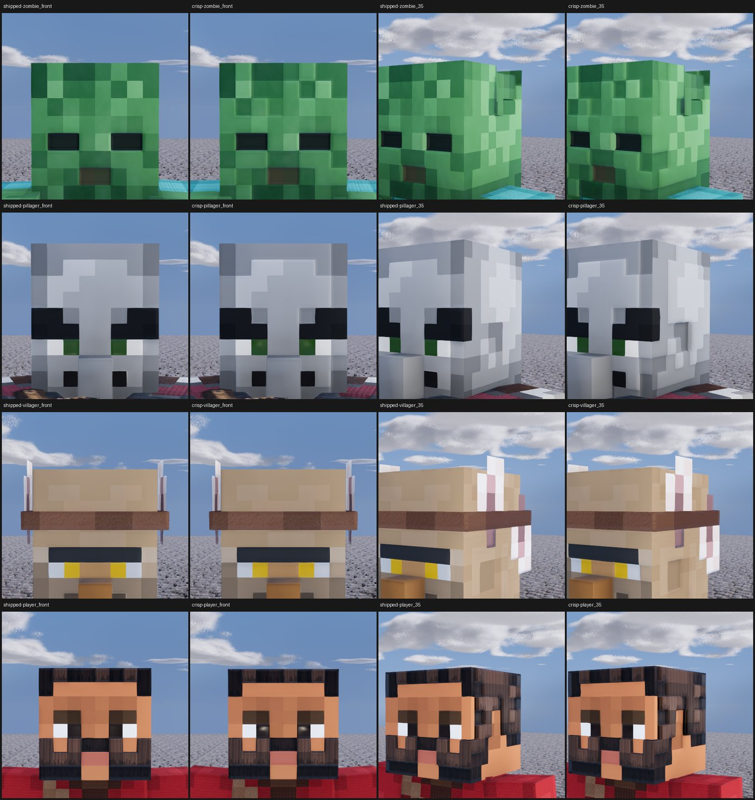
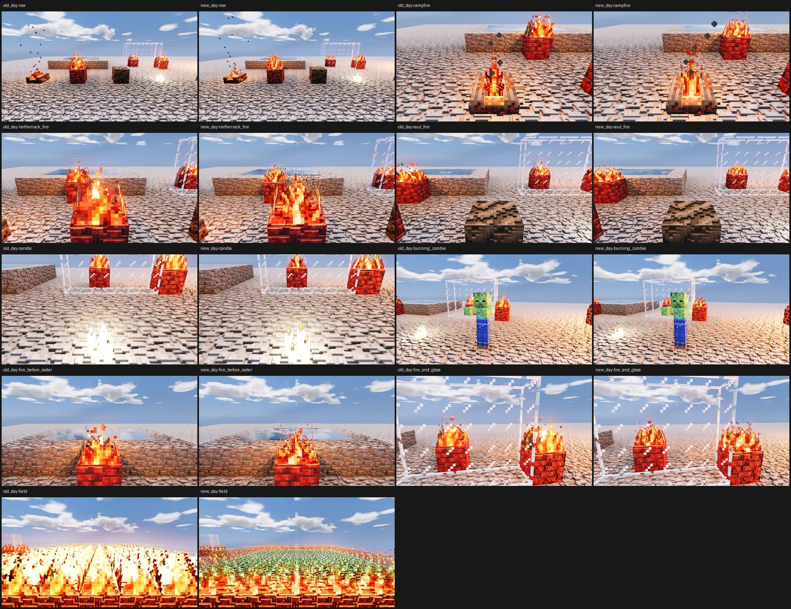
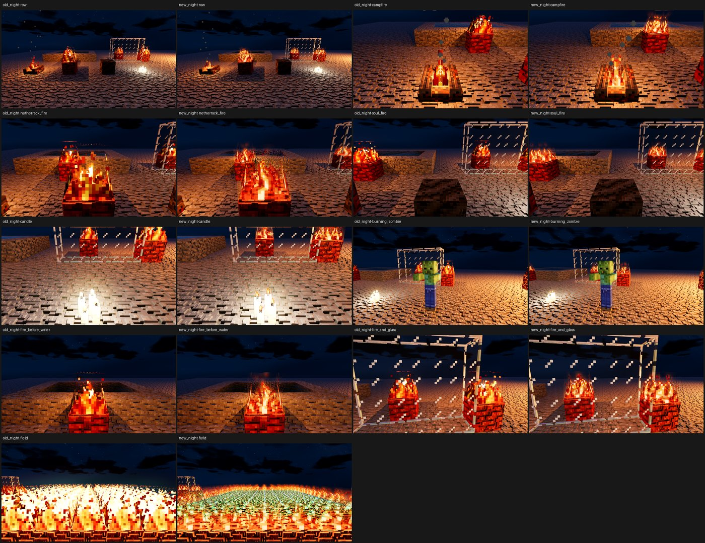
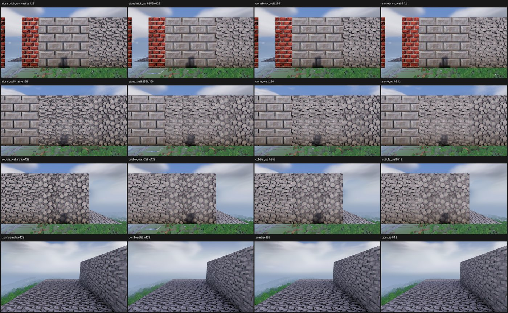

# Render backlog through the render service, 2026-10-06

The first run of `tools/goanna-render` on the GPU, then a backlog of looks
nobody had seen: portals, fire, worn armour and objects, and sculpted
faces.

Setup: RTX 3090, Godot 4.5.1, Luanti 5.17.0 server, Mineclonia release
38561, profile High read back at every launch, adapter "NVIDIA GeForce RTX
3090", `mat_parallax` 1. The build was main's checkout as it stood (HEAD
dec70408, then 019bc7d1, each with `project/material_ramp.gd` and
`project/project.godot` dirty), the pack its `pbr_packs/mineclonia`.

## What broke on the GPU, and the fixes

- **Frames of sky.** The first wall job reported success and drew no
  wall and no floor. Every node lookup matched, but the client had 0 to 5
  blocks meshed for minutes. `main.teleport_to` streams blocks with the
  camera still at the old place and only then moves it; the stage's blocks
  arrived tiered against a camera 1200 nodes away at the parking place and
  were never meshed. Reproduced by hand: 0 blocks meshed for 12 s after a
  `tp`, 8 once the camera was posed there. The service now poses the camera
  at the target before each `tp`, and an arrival also needs a block
  meshed. The client's own `teleport_to` order is unchanged.
- **Every pose waited out its 60 s settle timeout.** The far field's
  storage queues (`lod_storage_*`) never stayed at zero, so the settle
  test rarely held for 3 s. The far field is no longer granted on the
  fixture world, which has nothing past the stage (`--far` grants it).
  Each sidecar now says whether its pose settled and how long it waited.
- The player started at the stage, so the stage was held from the client's
  start; it now starts at the parking place.

After the fixes the wall job took 71 s (was 182 s with sky), the zombie job
101 s (was 288 s).

## 1. Validation

- Stone brick and cobble wall, noon and dusk (time 0.74): both drawn, the
  pack's relief on bricks, mortar and floor visible. Dusk is only a little
  warmer and darker than noon at this time of day.
- Zombie statue, maps on and off: maps on shows relief on the floor and
  shaded skin; maps off is flat art on a flat floor. The maps off sidecar
  has `maps_off_verified` true and no entity material with a normal map;
  maps on has the zombie's skin built with `normal=true spec=true`. The
  statue floats half a node: an entity's position is the bottom of its
  collision box, so a statue on the floor wants y -0.5 (now in the docs).
- Timing, the wall filling the frame at 1280 by 720, six rounds of 600
  `force_draw` draws: 1.85 ms per draw median with parallax on (range over
  rounds 1.845 to 1.853, p95 1.95) and 1.66 ms with it off (1.655 to
  1.661, p95 1.74). The earlier run of this job, before the fixes, gave
  1.97 ms for both: it was timing sky.
- Restart cost: 20 to 21 s for the first launch, 22.5 to 26.5 s for a
  restart (maps off, then back on).

The sidecar's material counts read 0 on every frame: they count only the
client's per texture material map, which node arrays do not use. The
documentation now says so.

## 2 to 4. The backlog

Shot in one service from 04:24 to 05:07, after the GPU came back. Builds:
main's checkout at f585dbdd (portals, objects) and c25a246d (the faces
reshoot), each with the same two dirty files; the fire branch's worktree at
3d3d94a1, clean. Packs: main's pack built from the tools at dec70408 into a
scratch directory (`build_pack.py --install`, 2090 sets), and the same with
`GOANNA_PBR_VARIANT=sculpt_crisp` for the faces. No pose waited out its
settle time and no frame logged a shader error.

### Nether and End portals

Lit Nether portal in obsidian (placed with `swap_node`), a glass tank of
water behind it, a villager in front; a ring of filled End frames round an
End portal. Afternoon (0.62) and night (0.0). 245 s, one 22 s restart (a
different pack).

- Front and 35 degrees: the purple sheet is drawn with its swirl, and the
  glass tank behind shows through it. At night the sheet still glows.
- Grazing: the sheet is edge on and nearly invisible, as it should be.
- From inside the water tank, behind the portal: **no sheet at all**. The
  frame is empty and the villager on the far side shows through clearly,
  at afternoon and night. The Nether sheet is not drawn from behind, or
  not through water.
- End, above, 35 degrees and close: the portal is a black starfield with
  coloured points, flat under the frames' tops. Close up, a bright white
  rim runs along the portal's edges against the frames, in daylight and at
  night.

### Armour, pickaxe, minecart, pot, heads, bookshelf

Noon and a low sun (0.27). 422 s, no restart. The armour is on figures with
the player's model, dressed by Mineclonia's own item texture functions:
iron, gold, chain, leather dyed `#b02e26`, diamond with a gold coast trim,
netherite.

- All six sets are drawn with the layers composed (helmet, chestplate,
  leggings, boots). Leather red covers the whole head as Mineclonia's
  helmet does. The diamond trim shows as gold lines.
- The iron pickaxe in the hand reads pale blue and glassy, like ice or
  glass rather than steel.
- The minecart is drawn, dark iron with its wooden floor.
- The decorated pot shows its four sherd faces (heart, archer, skull,
  miner) one per side, upright and flat on the side seen square on. The
  pot's neck and lid look lumpy.
- The zombie wall head sits on the wall; the creeper and zombie floor heads
  stand on the floor. The chiseled bookshelves show their books in the
  slots, empty slots dark.
- The low sun at 0.27 differs little from noon in these frames.

### Faces, `sculpt_crisp` against shipped

Zombie, pillager, villager and the default player, front and 35 degrees,
time 0.27. The first shot of this job framed the sky above the heads (the
poses were set for statues at y 0); it was reshot after the other jobs.
242 s, two restarts (19 and 22 s).

- Zombie: crisper steps between face texels in `sculpt_crisp`, most visible
  at 35 degrees where texel edges catch the light.
- Pillager: `sculpt_crisp` adds a step on the cheek beside the nose, a
  bright vertical edge at 35 degrees.
- Villager: almost no difference (mean grey level change 1.2 of 255
  front).
- Player: `sculpt_crisp` turns the pupils into dark glossy beads inside the
  eye whites, and sharpens the beard texels. The pupils are the biggest
  change of the four.

### Fire, old flame against the flame material

The fire branch's fixture moved onto the stage: campfire, fire on
netherrack, soul fire, candles, a burning zombie, fire before water and
beside glass, and a 9 by 9 fire field. `GOANNA_FLAME_MATERIAL=0` (old)
against the default (new), day (0.5) and night (0.0). 1415 s, two
restarts (23 and 30 s).

**No shader failed to compile**: no frame's sidecar and neither client log
has a shader error. The old client log builds the burning entity flame as
an ordinary entity material; the new one does not, so the flame path is
taken.

- The job reports a fault: the soul fire never stayed placed (the node was
  air at every check), so the soul fire frames show only the soul soil.
  The burning zombie shows no flames in either variant: the burn did not
  take on a statue whose `on_step` is shadowed.
- New flames have soft edges and a brightness ramp; old ones are hard
  pixel cut-outs. Candle flames go from blown-out white blobs to small
  yellow tips. The campfire is less blown out.
- Above the netherrack fire and the fire before the water, the new flame
  leaves a band of dark, noisy pixels in the air (the glow pass's
  shimmer), visible by day and by night.
- The fire field is badly wrong with the new material: the far rows are
  covered in cyan and green speckle, by day and by night. The old field is
  bright flame throughout.
- Water and glass behind flames keep their colour.

GPU time per draw, six rounds of 600 at 1280 by 720, High:

| pose | old day | new day | old night | new night |
|---|---|---|---|---|
| field | 4.87 ms | 5.48 ms | 4.91 ms | 5.48 ms |
| row | 4.86 ms | 4.80 ms | 4.84 ms | 4.79 ms |

The field filling the near frame costs about 0.6 ms more with the new
material; the row of single flames costs the same.

## Where the frames are

`~/.local/share/goanna-pbr-audit/render-backlog-2026-10-06/`, one
directory per item (`1-validate`, `2-portals`, `3-fire`, `4-objects`,
`4-faces`; `4-faces-misframed` is the first faces shot), each with
`sheet*.png`, every frame's sidecars and `result.json`. The jobs and the
script that writes them are in `jobs/`.

## The texture tier's 512 measurement

After the backlog, the texture tier agent's own run
(`docs/perf/texture-size-2026-10-05/run.py` in its worktree,
`agent-a4e4283996a2ac7ac`, built at 02:42) ran once under the GPU lock,
starting its clients through `tools/goanna-headless`: Medium at 1920 by
1080, two rounds, each configuration its own session. 2101 s, exit 0.
Results are in that worktree's `build/texsize/gpu2/results.json`.

| configuration | vista ms | wall ms | texture MiB | video MiB |
|---|---|---|---|---|
| 256 pack reduced to 128 | 4.45 | 2.65 | 1290 | 1470 |
| native 128 pack | 4.38 | 2.68 | 1297 | 1482 |
| 256 | 4.20 | 2.70 | 2591 | 2778 |
| 512 | 4.23 | 2.78 | 7743 | 8034 |

GPU time is the median of eight bursts of 400 draws. The vista moved by up
to 0.8 ms between the two rounds of one configuration (512: 3.83 and 4.66),
more than the spread between configurations, so the vista times do not
separate the tiers. The wall rises slightly with size (2.65 to 2.78 ms).
Texture memory is the clear result: 512 holds three times what 256 does,
7.7 GiB against 2.6 GiB. The 256 pack reduced in the client lands at the
same memory as the native 128 pack.

At this distance the walls look alike at every size. The "zombie" frame
has no zombie in it, in all four configurations.
