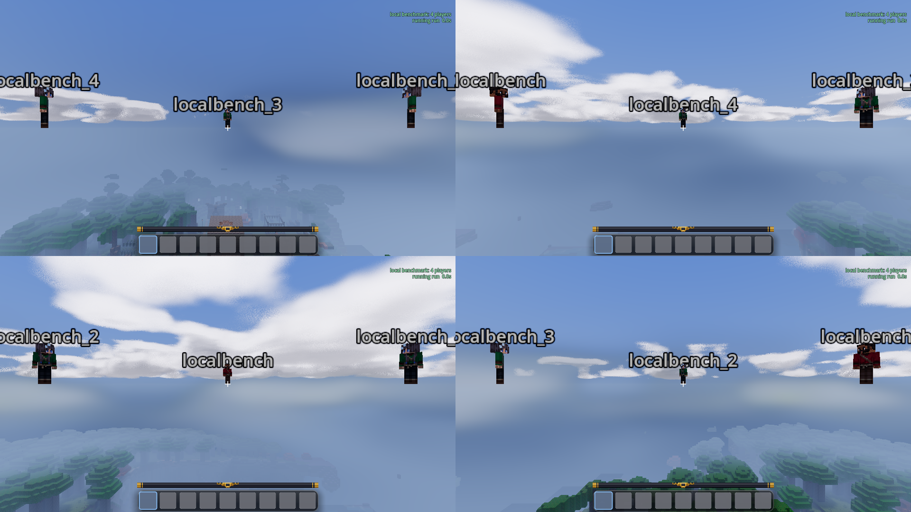

<!-- SPDX-License-Identifier: LGPL-2.1-or-later -->
# Render feature screening, 2026-09-27

The seven new feature switches worked in rendered one- and four-player
sessions. Disabling sky clouds or volumetric atmosphere reduced measured
GPU work, without a clear whole-frame improvement in this scene. This
supports further CPU profiling; it does not establish that shared terrain
will remove the remaining cost.

## Setup

- Ryzen 7 7800X3D, RTX 3090, Godot 4.5.1 Forward+ Vulkan, Luanti 5.17.0,
  Mineclonia ContentDB release 38561, the existing `test_world` fixture.
- Low profile, procedural grass off, default game textures, no installed
  PBR pack. Output 1920 by 1080, uncapped and vsync off. Four-player views
  are each 960 by 540. No MSAA was active.
- Same eight-node-radius inward circle as the earlier local benchmark,
  centred at Godot coordinates `(-72, 64, 378)`, held aloft at noon.
- Each player count used a fresh client configuration and disposable world
  copy. One client process at a time, inside headless gamescope. The GPU
  availability check passed before launch; the optional gamescope WSI layer
  was disabled as in the previous benchmark.
- Both trials settled before recording. Seven individual off variants,
  bracketed by fully enabled controls. Five-second warmup after each change,
  approximately 15 seconds recorded per variant. One sweep per player count.
- The source contains uncommitted changes. Build/script hashes are in
  [source-metadata.json](source-metadata.json); arguments are in
  [plan.json](plan.json).

This is a short screening run, not a final preset calibration. Clouds and
actors continue moving. The four-player views contain other players and
different sky/terrain coverage, so they are not identical copies of the
single-player view.

## Results

All values below are median milliseconds. Frame time is the full application
frame interval. GPU is the sum of measured root/player viewport times,
not an independent wall-clock GPU critical path. Do not subtract it from
frame time to derive CPU cost.

| Variant | 1p frame | 1p GPU | 4p frame | 4p summed GPU |
| --- | ---: | ---: | ---: | ---: |
| Control before | 2.862 | 2.410 | 11.987 | 5.711 |
| Sky clouds off | 2.889 | 1.693 | 12.340 | 4.697 |
| Cloud shadows off | 2.949 | 2.408 | 13.134 | 5.994 |
| Volumetric atmosphere off | 2.909 | 2.039 | 13.174 | 4.371 |
| SSAO off | 2.958 | 2.361 | 13.151 | 5.892 |
| Bloom off | 2.968 | 2.316 | 12.186 | 5.382 |
| Screen-space shafts off | 2.943 | 2.422 | 12.304 | 5.523 |
| Sun/moon shadows off | 2.779 | 2.261 | 11.825 | 5.143 |
| Control after | 3.032 | 2.496 | 12.376 | 5.680 |

Control frame-time drift was +5.94% for one player and +3.25% for four.
GPU drift was +3.57% and -0.54% respectively. These are endpoints from one
sweep, not confidence intervals or bounds on variation within the sweep.
Several intermediate four-player rows were slower than both controls;
do not interpret every difference as a feature cost.

Relative to the first control, sky-cloud GPU time fell about 30% solo and
18% with four players; atmosphere GPU time fell about 15% and 23%.
Those GPU changes did not yield matching frame-time improvements. Shader
quality can therefore still matter on weaker GPUs, while reducing it on
this desktop need not address the limiting work.

Directional shadows are another useful follow-up: four-player measured
renderer CPU median fell from 2.598 to 2.348 ms and summed GPU median from
5.711 to 5.143 ms. The full-frame difference is small enough to need repeated
tests before changing a preset.

The other switches remain useful experiment controls, but this run does
not justify claims that their effects are free or harmful. In particular,
shaft strength was already inactive at noon. Its row tests removal of an
otherwise ineffective quad, not the cost of active dusk rays. This run also
does not cover underwater rendering, wet weather, night lighting, close
foliage/materials, streaming or ice.

## Validation and implications

All 45 saved per-player variant states matched the requested switches, with
each disabled feature's gate off. Every view had terrain meshes, grass was
off, and the repeated controls restored all switches. One- and four-player
control/cloud-off captures were inspected, as was the four-player
atmosphere-off capture. The cloud march disappears while ordinary fog stays;
atmosphere-off retains terrain and the independent sky clouds.

No Godot script, shader or engine errors were found in either completed
client log. Gamescope logged its format-modifier warnings, but rendering
completed. Separate dummy-renderer regressions passed for feature settings,
player scene ownership and menus. Underwater switch state was tested in the
scene regression; no live underwater visual claim is made here.

The next useful CPU experiment is to attribute complete per-player updates
and terrain publication, then measure duplicate inputs for nearby players.
The [sharing proposal](../../systems/render-feature-switches.md) starts with
immutable preparation/geometry and preserves session knowledge. This sweep
does not implement or measure a shared terrain cache. Memory pressure was
not diagnosed, and RAM reduction is not a conclusion from these results.

## Captures and data

[Sky clouds disabled](4p-no-sky-clouds.png) and
[volumetric atmosphere disabled](4p-no-atmosphere.png) show the independent
switches in the same composition.

[measurements.json](measurements.json) contains summaries, including tails
and feature state. [raw-data.tar.gz](raw-data.tar.gz) preserves all frame
CSVs, per-player samples, hardware samples, initial state, settling checks
and per-trial results. All captures, client logs and disposable worlds remain
under `/tmp/goanna-feature-sweep-20260927` on this machine.
