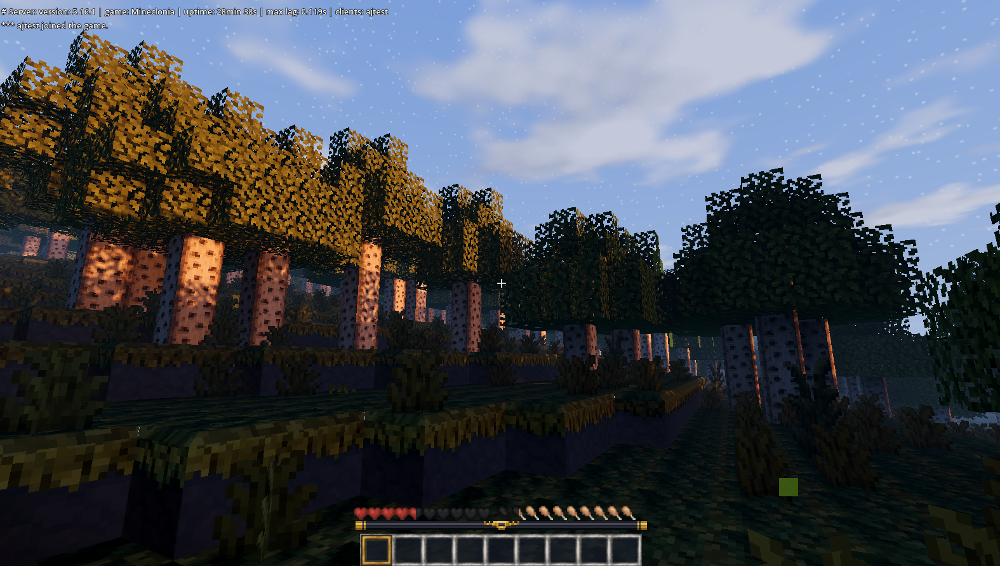
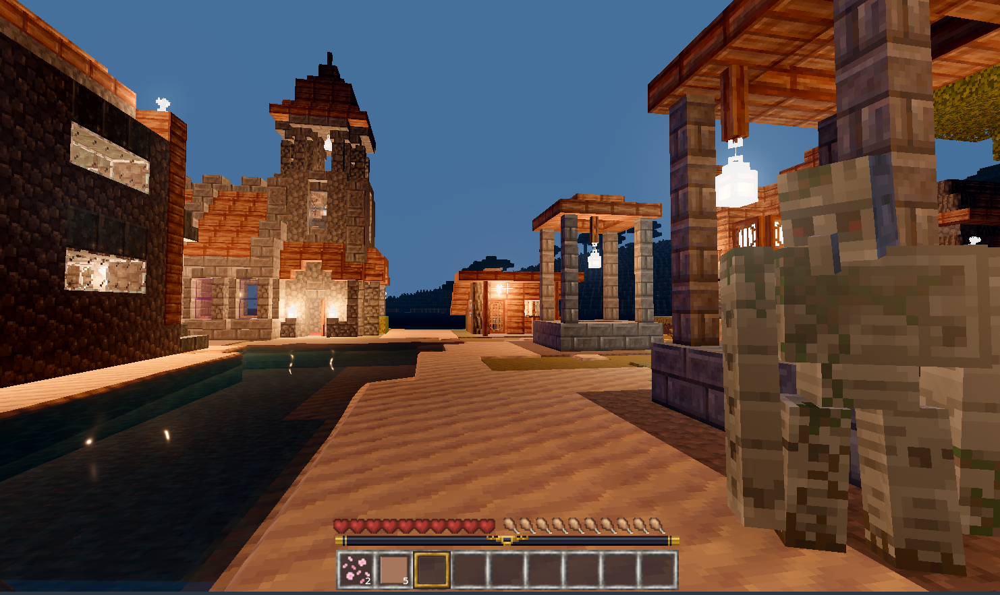
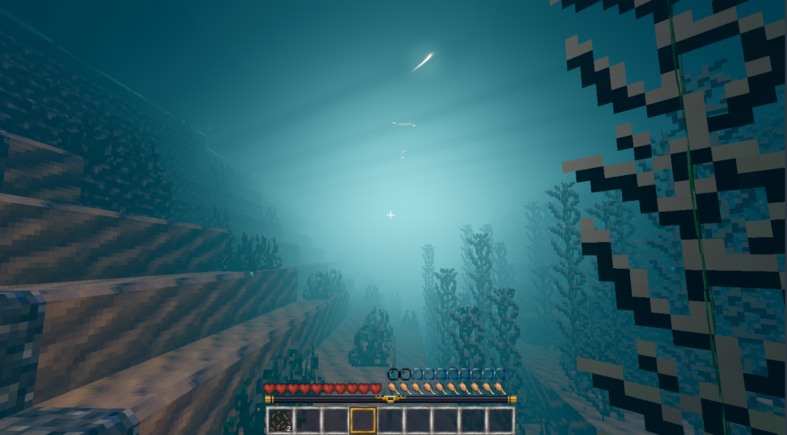

# Player guide

Goanna is an alternative Luanti client. You use the same account, servers,
games and worlds as with Luanti's own client. A server does not need to know
about Goanna for ordinary play.

## What it looks like

These are representative Goanna renders from the current development build.
They are illustrative rather than a promise that every server, shader pack or
GPU will produce identical results.

## Requirements

The current supported development target is Linux with Godot 4.5 and a
working Vulkan driver. A discrete GPU is strongly recommended. Goanna renders
more lighting and distant terrain than the vanilla client, so performance
depends on GPU, CPU, view distance, shader settings and the server's streaming
limits. See [requirements.md](requirements.md) for measured guidance.

Luanti is required only for Start Game. Goanna launches the Luanti server
locally and connects through the normal protocol. Join Game can connect to a
remote server without a local Luanti installation.

### Which Luanti Start Game uses

Goanna looks for Luanti where each kind of package puts it: distribution
packages (Debian and Ubuntu keep their games under
`/usr/share/games/minetest`), Flatpak (user and system installations), Snap,
AppImages in the usual folders, and on Windows the unpacked zip or the
self-extracting build. When it finds more than one, it uses the one you chose,
or else the first that has a game. **Change** on the Start Game screen lists
everything it found, with each install's games and data folder.

### Get ready to play

If Goanna finds no Luanti, or the one it found has no games, Start Game
offers **Get ready to play**: one button that gets both, with no password
and no package manager.

- **The server.** The Linux release carries its own Luanti 5.17.0 server
  (`Goanna/luanti-server/`), built unmodified from upstream and needing
  nothing from the system. Goanna copies it into its own data folder, where
  its worlds are kept. On Windows it downloads the official Luanti zip, as
  Install Luanti does below. Run from a source checkout on Linux, it uses
  `dist/luanti-server/` after `tools/build-luanti-server.sh`, or else
  Flathub.
- **The game.** When the Luanti has no games, it downloads Mineclonia
  0.123.1 from ContentDB (29 MB), the release Goanna's materials are made
  for, checks it against the hash Goanna carries and installs it into that
  Luanti's games. Luanti's own Content tab can update it or add others later.

It then opens Start Game with a new world ready. Checked from nothing to a
running world in clean Ubuntu 22.04 and 24.04, Debian 12, Fedora 42 and Arch
containers (`tools/test-fresh-install.sh`), and through the menu on Bazzite
with a GPU. The server needs glibc 2.35 or newer, so Ubuntu 22.04, Debian 12
or anything later. macOS has no Goanna release yet, so it is not covered.

**Choose Luanti myself**, or **Change** on the Start Game screen, opens the
list of what Goanna found instead, with these options:

- **Locate Luanti** takes the folder Luanti was unpacked into, its `bin`
  folder, the Luanti program itself, or an AppImage.
- **Install Luanti** installs the Flathub build on Linux (the confirmation
  shows the exact `flatpak` commands first). On Windows it downloads the
  official Luanti 5.17.0 zip from GitHub, checks it against the hash Goanna
  carries, and unpacks it into Goanna's own data folder, where its worlds are
  kept too. On macOS, or on Linux without Flatpak, use **Download page** or
  your distribution's packages instead.
- **Get ready to play** appears when the chosen Luanti has nothing to start,
  and installs Mineclonia as above.
- **Open Luanti** starts that install's own client, where other games can be
  installed from its Content tab; press **Rescan** after.
- **Show where Goanna looked** lists every place it searched, for a bug
  report when your install is still not found.

Not yet tried on Windows itself: the Windows lookup, the Windows install and
Get ready to play on Windows have only been exercised against the real zip
unpacked on Linux.

## Starting a game

Start Game lets you select an existing world or create one. New worlds can
choose the installed game's default generator or one of several Terrain
Diffusion worlds. Each is a whole 62 km world at a metre a node; they differ
in where they are, not in how detailed they are, and the picker shows a map
and a size for each. The one you choose downloads once, is verified against
its published hash, and is kept for later worlds; choosing a second world
does not discard the first. Generated data belongs to each world and is not
overwritten when the shared cache changes.

Do not select Terrain Diffusion for an existing populated conventional world.
The launcher rejects that combination because old mapblocks would remain and
produce two overlapping landscapes.

The same screen controls creative mode, damage, mods and optional hosting.
PBR companion maps are independently versioned assets rather than part of the
Goanna executable download. Install a bundle once and Goanna composes its
terrain, billboard and creature tranches under
`user://content/goanna-assets/profiles/<game>/textures`. The Materials dropdown
can also select a conventional installed texture pack such as Craft and Ruin,
or Standard to disable PBR.

When joining a remote server, choose **PBR: server materials**, an installed
game profile, or **Standard, no PBR** on the Join Game screen.
Remote selection is client-side and supplies only normal and material
companions, so a server's Iron, Stone or other style textures stay visible.
Hosting starts a normal Luanti server and can expose a name, description,
password, port, player limit and public-list announcement.

## Updates

A downloaded release keeps itself up to date. When the menu opens it asks
GitHub for the newest release, and if there is one it offers **Update and
restart** on the main screen. The update downloads, is checked against the
maintainer's signature, replaces Goanna's own files and starts the new
version. Worlds, settings and materials are kept in Goanna's data folder and
are not touched. **About** shows the version you have, checks on demand and
can turn the check off. If Goanna is installed somewhere it cannot write to,
it says so and you download the new release yourself. A source checkout
never updates itself.

Releases before 0.11.0 do not have this, so moving from 0.10.0 means one
last download by hand.

## Controls

WASD moves, the mouse looks, Space jumps, Shift sneaks, and the left and right
mouse buttons dig and place. Number keys select the hotbar. `I` opens the
inventory; so does `E`, unless something is pointed, in which case `E` uses
it instead, the same as a right click. `T` opens chat, `F` toggles the free
camera, and Escape opens the pause menu. The exact bindings and camera
options can be changed in Settings.

`F7` cycles the camera the way the vanilla client does: first person,
behind the player, then in front looking back. In either third person view,
hold `Alt` and move the mouse to turn the camera around the player without
turning the player, and hold `Alt` with the mouse wheel to bring it closer.
It goes no further out than the vanilla client's third person camera, 2.75
nodes, and it stops short of walls. In the front view nothing can be dug or
placed, as in the vanilla client.

A game controller follows upstream Luanti's layout, and outside play its
left stick moves a cursor for menus and forms. It has not been tried with a
real controller yet, including on a Steam Deck. See
[controller.md](controller.md).

The performance overlay can show FPS, draw calls, object and triangle counts,
terrain queues, occlusion and world position. It is useful when reporting a
performance or streaming problem.

## Accessibility

`Ctrl+B` turns on Read aloud, which speaks chat, on screen text, what you
point at and hold, and forms and menus through your system's voice. What
it covers and what it does not yet are in
[accessibility.md](accessibility.md).

## Interface style

Settings, Appearance, Interface style chooses how menus and game forms look.
It takes effect at once, in the main menu or in game.

- Dark glass, the default, draws Goanna's menus, chat, the hotbar and every
  game form (inventories, chests, furnaces and the rest) on dark translucent
  panels that blur the world behind them. The game's own pictures are kept:
  items, the empty armour slot outlines, progress arrows, player models,
  books and any screen a game draws with its own art. Only the plain window
  parts, the grey panels, slot squares, tab and button frames, are
  replaced; a tab keeps the game's icon, and the selected one is ringed.
  Dark text a game chose for its light panels is lightened so it can be read
  on the dark glass.
- Game theme draws every form in the game's own window art, as the game's
  authors made it and as Luanti's own client shows it, and Goanna's menus as
  they were before the glass.

Neither choice changes what a form does or sends to the server. Details, and
what is not handled yet, are in [interface-style.md](interface-style.md).

## Rendering options

Goanna's important visual systems are adjustable while connected:

- View and far distance control how much live and remembered terrain is drawn.
- Terrain occlusion removes regions hidden behind opaque nearby geometry.
- Material settings control normals, roughness, specular, emission, bevels and
  surface detail.
- Lighting settings control SDFGI, ambient light, lamps, shadows and shafts.
  With lamp shadows enabled, their budget also limits direct lamp count so
  excess lamps cannot shine through walls. Distant lighting uses propagated
  block light. Zero shadow-casting lamps explicitly disables lamp shadows.
- The Appearance tab has Natural look, Night visibility and Bloom controls.
  Natural look adds depth in high daylight; night, dawn and sunset keep their
  existing grade. Night visibility defaults to 0.5 and adds a faint blue
  upper sky, supplying cool ambient and bounced light through the existing
  lighting system. It leaves the horizon colour and night grade unchanged;
  zero restores the original sky. These preferences are independent of the
  graphics quality profile.
- Volumetric atmosphere controls the local valley-mist volume; set it to zero
  to disable that froxel cost on slower hardware. The raymarched cumulus
  stay in the sky pass and share the terrain's sun, twilight and
  horizon-haze colours.

Terrain that has not arrived from the server cannot be reconstructed by a
normal client. Goanna can display remembered blocks and server-provided coarse
summaries when the server grants its far-rendering capability; otherwise the
horizon is limited by the server's send and generation distance.

## Current limitations

The project is alpha quality. Known gaps include some dropped-item models,
animated inventory icons, parts of particle behaviour, connected textures
and the long tail of game-specific formspec and drawtype behaviour. Shader-pack
support currently covers the screen-space composite/final path, not the full
world gbuffers pipeline. Controller support is untested on real hardware.

When reporting a problem, include the game and server, whether it is a new or
existing world, your view/far distances, the performance overlay and a
screenshot if the issue is visual.
